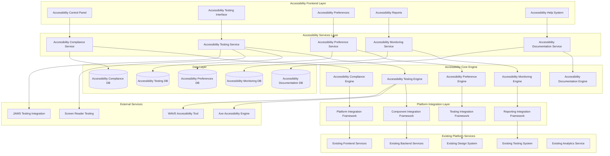

# Accessibility Compliance System (WCAG 2.1 AA) - Design Document

## Overview

The Accessibility Compliance System ensures the entire SynapseAI platform meets WCAG 2.1 AA accessibility standards through automated testing, compliance monitoring, assistive technology integration, and accessibility-first design patterns. This system provides comprehensive accessibility features, user customization options, and compliance reporting while maintaining seamless integration with all existing platform components.

## Architecture

### High-Level System Architecture



### Component Architecture

#### 1. Accessibility Compliance Engine

**Purpose:** Ensures comprehensive WCAG 2.1 AA compliance across all platform components with automated validation and remediation.

**Key Components:**
- **WCAG Validator:** Comprehensive WCAG 2.1 AA compliance checking and validation
- **Semantic Analyzer:** HTML semantic structure analysis and optimization
- **ARIA Manager:** Automated ARIA attribute generation and validation
- **Focus Manager:** Keyboard navigation and focus management system
- **Color Contrast Analyzer:** Color contrast validation and optimization
- **Alternative Text Generator:** AI-powered alt-text generation for images and media

**Integration Points:**
- Integrates with all existing frontend components for compliance validation
- Uses existing Design System for accessible component patterns
- Connects to existing Analytics Service for compliance metrics
- Uses existing Notification Service for compliance alerts

#### 2. Accessibility Testing Engine

**Purpose:** Provides automated accessibility testing, continuous monitoring, and regression detection throughout the development lifecycle.

**Key Components:**
- **Automated Test Runner:** Continuous accessibility testing in CI/CD pipeline
- **Accessibility Linter:** Real-time accessibility linting during development
- **Regression Detector:** Accessibility regression detection and alerting
- **Performance Impact Analyzer:** Accessibility feature performance monitoring
- **Cross-Browser Tester:** Accessibility testing across different browsers and devices
- **Assistive Technology Simulator:** Screen reader and assistive technology simulation

**Integration Points:**
- Integrates with existing Testing System for automated test execution
- Uses existing CI/CD pipeline for continuous accessibility testing
- Connects to external accessibility testing tools (Axe, WAVE)
- Uses existing Monitoring Service for test result tracking

#### 3. Accessibility Preference Engine

**Purpose:** Manages user accessibility preferences, customizations, and adaptive interface modifications.

**Key Components:**
- **Preference Manager:** User accessibility preference storage and synchronization
- **Adaptive Interface Engine:** Dynamic interface adaptation based on user needs
- **Customization Engine:** Visual, auditory, and motor accessibility customizations
- **Profile Synchronizer:** Cross-device accessibility preference synchronization
- **Accessibility Onboarding:** Guided accessibility setup and configuration
- **Preference Analytics:** Accessibility preference usage analysis and optimization

**Integration Points:**
- Uses existing User Management Service for preference storage
- Integrates with existing Session Service for preference application
- Connects to existing Design System for customization options
- Uses existing Analytics Service for preference usage tracking

#### 4. Accessibility Monitoring Engine

**Purpose:** Provides real-time accessibility compliance monitoring, reporting, and continuous improvement tracking.

**Key Components:**
- **Compliance Monitor:** Real-time accessibility compliance tracking
- **Violation Detector:** Accessibility violation detection and classification
- **Remediation Tracker:** Accessibility issue remediation progress tracking
- **Compliance Reporter:** Automated accessibility compliance reporting
- **Trend Analyzer:** Accessibility improvement trend analysis
- **Alert Manager:** Accessibility compliance alerting and escalation

**Integration Points:**
- Extends existing Analytics Service with accessibility-specific metrics
- Uses existing Notification Service for compliance alerts
- Integrates with existing Audit Service for compliance logging
- Connects to existing Dashboard Service for compliance visualization

#### 5. Accessibility Documentation Engine

**Purpose:** Provides comprehensive accessibility documentation, training, and guidance for developers and content creators.

**Key Components:**
- **Documentation Generator:** Automated accessibility documentation generation
- **Training Module Manager:** Interactive accessibility training and tutorials
- **Best Practice Library:** Accessibility best practices and implementation guides
- **Code Example Generator:** Accessible code examples and patterns
- **Troubleshooting Assistant:** Accessibility issue diagnosis and resolution guidance
- **Knowledge Base:** Searchable accessibility knowledge and FAQ system

**Integration Points:**
- Uses existing Documentation System for content management
- Integrates with existing Training System for accessibility education
- Connects to existing Knowledge Base for accessibility information
- Uses existing Search Service for documentation discovery

## Data Models

### Accessibility Compliance Schema

```typescript
interface AccessibilityCompliance {
  id: string;
  componentId: string;
  componentType: ComponentType;
  organizationId: string;
  
  // WCAG compliance status
  wcagLevel: WCAGLevel; // 'A' | 'AA' | 'AAA'
  complianceScore: number; // 0-100
  lastAssessed: Date;
  
  // Compliance details
  violations: AccessibilityViolation[];
  warnings: AccessibilityWarning[];
  successes: AccessibilitySuccess[];
  
  // Testing results
  automatedTestResults: AutomatedTestResult[];
  manualTestResults: ManualTestResult[];
  
  // Remediation tracking
  remediationStatus: RemediationStatus;
  remediationPlan: RemediationPlan;
  remediationHistory: RemediationHistory[];
  
  // Metadata
  assessedBy: string;
  nextAssessment: Date;
  tags: string[];
  notes: string;
}

interface AccessibilityViolation {
  id: string;
  ruleId: string;
  wcagCriterion: string;
  severity: ViolationSeverity; // 'CRITICAL' | 'SERIOUS' | 'MODERATE' | 'MINOR'
  impact: ViolationImpact; // 'CRITICAL' | 'SERIOUS' | 'MODERATE' | 'MINOR'
  
  // Violation details
  description: string;
  element: ElementSelector;
  context: ViolationContext;
  
  // Remediation
  remediation: RemediationGuidance;
  estimatedEffort: EffortEstimate;
  priority: Priority;
  
  // Tracking
  status: ViolationStatus; // 'OPEN' | 'IN_PROGRESS' | 'RESOLVED' | 'DEFERRED'
  assignedTo: string;
  dueDate: Date;
  resolvedAt?: Date;
  
  createdAt: Date;
  updatedAt: Date;
}

interface AccessibilityPreferences {
  userId: string;
  organizationId: string;
  
  // Visual preferences
  visualPreferences: VisualAccessibilityPreferences;
  
  // Auditory preferences
  auditoryPreferences: AuditoryAccessibilityPreferences;
  
  // Motor preferences
  motorPreferences: MotorAccessibilityPreferences;
  
  // Cognitive preferences
  cognitivePreferences: CognitiveAccessibilityPreferences;
  
  // Device preferences
  devicePreferences: DeviceAccessibilityPreferences;
  
  // Synchronization
  syncAcrossDevices: boolean;
  lastSynced: Date;
  
  createdAt: Date;
  updatedAt: Date;
}

interface VisualAccessibilityPreferences {
  // Font and text
  fontSize: FontSizeLevel; // 'SMALL' | 'MEDIUM' | 'LARGE' | 'EXTRA_LARGE'
  fontFamily: AccessibleFontFamily;
  lineHeight: LineHeightLevel;
  letterSpacing: LetterSpacingLevel;
  
  // Color and contrast
  highContrast: boolean;
  colorScheme: ColorScheme; // 'LIGHT' | 'DARK' | 'AUTO'
  customColors: CustomColorPalette;
  
  // Motion and animation
  reduceMotion: boolean;
  animationSpeed: AnimationSpeed;
  
  // Layout and spacing
  increasedSpacing: boolean;
  simplifiedLayout: boolean;
  
  // Focus and navigation
  enhancedFocus: boolean;
  focusIndicatorStyle: FocusIndicatorStyle;
}

interface AccessibilityTestResult {
  id: string;
  testSuiteId: string;
  componentId: string;
  testType: TestType; // 'AUTOMATED' | 'MANUAL' | 'ASSISTIVE_TECHNOLOGY'
  
  // Test execution
  executedAt: Date;
  executedBy: string;
  environment: TestEnvironment;
  
  // Results
  overallResult: TestResult; // 'PASS' | 'FAIL' | 'WARNING' | 'INCOMPLETE'
  violations: AccessibilityViolation[];
  warnings: AccessibilityWarning[];
  
  // Performance impact
  performanceImpact: PerformanceImpact;
  
  // Assistive technology results
  screenReaderResults: ScreenReaderTestResult[];
  keyboardNavigationResults: KeyboardTestResult[];
  voiceControlResults: VoiceControlTestResult[];
  
  // Metadata
  testDuration: number;
  testConfiguration: TestConfiguration;
  notes: string;
}
```

### Accessibility Monitoring Schema

```typescript
interface AccessibilityMonitoring {
  organizationId: string;
  timeframe: TimeframeType;
  
  // Overall compliance metrics
  overallComplianceScore: number;
  wcagAACompliance: number;
  wcagAAACompliance: number;
  
  // Violation metrics
  totalViolations: number;
  criticalViolations: number;
  resolvedViolations: number;
  averageResolutionTime: number;
  
  // Component compliance
  componentCompliance: ComponentComplianceMetrics[];
  
  // User impact metrics
  usersWithAccessibilityNeeds: number;
  accessibilityFeatureUsage: AccessibilityFeatureUsage[];
  userSatisfactionScore: number;
  
  // Trend analysis
  complianceTrends: ComplianceTrend[];
  violationTrends: ViolationTrend[];
  
  // Performance metrics
  accessibilityPerformanceImpact: PerformanceImpact;
  
  lastUpdated: Date;
}

interface AccessibilityTraining {
  id: string;
  title: string;
  description: string;
  targetAudience: TrainingAudience; // 'DEVELOPER' | 'DESIGNER' | 'CONTENT_CREATOR' | 'TESTER' | 'MANAGER'
  
  // Content
  modules: TrainingModule[];
  assessments: TrainingAssessment[];
  resources: TrainingResource[];
  
  // Progress tracking
  completionTracking: CompletionTracking;
  certificationAvailable: boolean;
  
  // Metadata
  difficulty: DifficultyLevel;
  estimatedDuration: number;
  prerequisites: string[];
  tags: string[];
  
  createdBy: string;
  createdAt: Date;
  updatedAt: Date;
}

interface AccessibilityDocumentation {
  id: string;
  title: string;
  type: DocumentationType; // 'GUIDELINE' | 'TUTORIAL' | 'REFERENCE' | 'TROUBLESHOOTING' | 'BEST_PRACTICE'
  
  // Content
  content: DocumentationContent;
  codeExamples: CodeExample[];
  interactiveExamples: InteractiveExample[];
  
  // Organization
  category: DocumentationCategory;
  subcategory: string;
  tags: string[];
  
  // Accessibility
  accessibleFormats: AccessibleFormat[];
  alternativeFormats: AlternativeFormat[];
  
  // Maintenance
  lastReviewed: Date;
  reviewSchedule: ReviewSchedule;
  maintainer: string;
  
  createdAt: Date;
  updatedAt: Date;
}
```

## Component Interfaces

### Accessibility Compliance Interface

```typescript
interface IAccessibilityComplianceService {
  // Compliance assessment
  assessCompliance(componentId: string): Promise<AccessibilityCompliance>;
  getComplianceStatus(organizationId: string): Promise<ComplianceStatus>;
  validateWCAGCompliance(element: HTMLElement): Promise<WCAGValidationResult>;
  
  // Violation management
  getViolations(filter: ViolationFilter): Promise<AccessibilityViolation[]>;
  resolveViolation(violationId: string, resolution: ViolationResolution): Promise<void>;
  bulkResolveViolations(violationIds: string[], resolution: ViolationResolution): Promise<BulkResolutionResult>;
  
  // Remediation
  generateRemediationPlan(violations: AccessibilityViolation[]): Promise<RemediationPlan>;
  trackRemediationProgress(planId: string): Promise<RemediationProgress>;
  
  // Reporting
  generateComplianceReport(organizationId: string, options: ReportOptions): Promise<ComplianceReport>;
  scheduleComplianceReport(schedule: ReportSchedule): Promise<void>;
}

interface IAccessibilityTestingService {
  // Automated testing
  runAutomatedTests(componentId: string): Promise<AutomatedTestResult>;
  runContinuousTests(testSuite: TestSuite): Promise<ContinuousTestResult>;
  
  // Manual testing
  createManualTestPlan(componentId: string): Promise<ManualTestPlan>;
  recordManualTestResult(testId: string, result: ManualTestResult): Promise<void>;
  
  // Assistive technology testing
  testWithScreenReader(componentId: string, screenReader: ScreenReaderType): Promise<ScreenReaderTestResult>;
  testKeyboardNavigation(componentId: string): Promise<KeyboardTestResult>;
  testVoiceControl(componentId: string): Promise<VoiceControlTestResult>;
  
  // Regression testing
  detectRegressions(baselineId: string, currentId: string): Promise<RegressionResult>;
  createTestBaseline(componentId: string): Promise<TestBaseline>;
  
  // Performance testing
  measureAccessibilityPerformance(componentId: string): Promise<AccessibilityPerformanceResult>;
}

interface IAccessibilityPreferenceService {
  // Preference management
  getUserPreferences(userId: string): Promise<AccessibilityPreferences>;
  updateUserPreferences(userId: string, preferences: AccessibilityPreferences): Promise<void>;
  resetPreferences(userId: string): Promise<void>;
  
  // Preference application
  applyPreferences(userId: string, context: ApplicationContext): Promise<PreferenceApplication>;
  getAdaptedInterface(userId: string, componentId: string): Promise<AdaptedInterface>;
  
  // Synchronization
  syncPreferencesAcrossDevices(userId: string): Promise<SyncResult>;
  getPreferenceSyncStatus(userId: string): Promise<SyncStatus>;
  
  // Analytics
  getPreferenceUsageAnalytics(organizationId: string): Promise<PreferenceAnalytics>;
  getPreferenceEffectivenessMetrics(preferenceType: PreferenceType): Promise<EffectivenessMetrics>;
}
```

## Error Handling

### Accessibility Compliance Error Handling

```typescript
enum AccessibilityComplianceErrorType {
  WCAG_VALIDATION_FAILED = 'WCAG_VALIDATION_FAILED',
  COMPLIANCE_ASSESSMENT_FAILED = 'COMPLIANCE_ASSESSMENT_FAILED',
  VIOLATION_RESOLUTION_FAILED = 'VIOLATION_RESOLUTION_FAILED',
  REMEDIATION_PLAN_GENERATION_FAILED = 'REMEDIATION_PLAN_GENERATION_FAILED',
  ACCESSIBILITY_TEST_FAILED = 'ACCESSIBILITY_TEST_FAILED',
  PREFERENCE_APPLICATION_FAILED = 'PREFERENCE_APPLICATION_FAILED'
}

class AccessibilityComplianceError extends Error {
  constructor(
    public type: AccessibilityComplianceErrorType,
    public message: string,
    public componentId?: string,
    public wcagCriterion?: string,
    public severity?: ViolationSeverity,
    public remediation?: RemediationGuidance
  ) {
    super(message);
  }
}
```

### Accessibility Testing Error Handling

```typescript
enum AccessibilityTestingErrorType {
  AUTOMATED_TEST_EXECUTION_FAILED = 'AUTOMATED_TEST_EXECUTION_FAILED',
  SCREEN_READER_TEST_FAILED = 'SCREEN_READER_TEST_FAILED',
  KEYBOARD_NAVIGATION_TEST_FAILED = 'KEYBOARD_NAVIGATION_TEST_FAILED',
  PERFORMANCE_TEST_FAILED = 'PERFORMANCE_TEST_FAILED',
  REGRESSION_DETECTION_FAILED = 'REGRESSION_DETECTION_FAILED',
  TEST_ENVIRONMENT_UNAVAILABLE = 'TEST_ENVIRONMENT_UNAVAILABLE'
}

class AccessibilityTestingError extends Error {
  constructor(
    public type: AccessibilityTestingErrorType,
    public message: string,
    public testId?: string,
    public componentId?: string,
    public testEnvironment?: TestEnvironment,
    public recovery?: RecoveryStrategy
  ) {
    super(message);
  }
}
```

## Security and Privacy Architecture

### Accessibility Data Protection

```typescript
interface AccessibilitySecurityConfiguration {
  // Data protection
  preferenceEncryption: EncryptionConfiguration;
  testDataProtection: DataProtectionConfiguration;
  complianceDataRetention: RetentionPolicy;
  
  // Privacy controls
  preferencePrivacy: PrivacyConfiguration;
  testResultPrivacy: PrivacyConfiguration;
  analyticsPrivacy: PrivacyConfiguration;
  
  // Access controls
  complianceDataAccess: AccessControlConfiguration;
  testingPermissions: TestingPermissionConfiguration;
  
  // Audit and compliance
  accessibilityAuditLogging: AuditLoggingConfiguration;
  privacyComplianceMonitoring: PrivacyComplianceConfiguration;
}
```

## Testing Strategy

### Unit Testing
- **Accessibility Compliance Components:** Test WCAG validation, violation detection, and remediation guidance
- **Accessibility Testing Engine:** Test automated testing, screen reader simulation, and regression detection
- **Preference Management:** Test preference storage, application, and synchronization
- **Documentation System:** Test documentation generation, training modules, and knowledge base

### Integration Testing
- **Platform Integration:** Test accessibility integration with all existing SynapseAI components
- **Assistive Technology Integration:** Test integration with screen readers, voice control, and other assistive devices
- **External Tool Integration:** Test integration with Axe, WAVE, and other accessibility testing tools
- **Cross-Browser Testing:** Test accessibility features across different browsers and devices

### Accessibility Testing
- **WCAG 2.1 AA Compliance:** Comprehensive testing against all WCAG 2.1 AA success criteria
- **Screen Reader Testing:** Testing with NVDA, JAWS, VoiceOver, and other screen readers
- **Keyboard Navigation Testing:** Complete keyboard accessibility testing for all interactions
- **Voice Control Testing:** Testing with Dragon NaturallySpeaking and other voice control software

### Performance Testing
- **Accessibility Feature Performance:** Test performance impact of accessibility features
- **Large-Scale Compliance Testing:** Test accessibility testing performance with large codebases
- **Preference Application Performance:** Test performance of dynamic accessibility adaptations
- **Real-time Monitoring Performance:** Test accessibility monitoring system performance

### User Experience Testing
- **Accessibility User Testing:** Testing with users who have various disabilities
- **Preference Customization Testing:** Test accessibility preference interfaces and effectiveness
- **Training Effectiveness Testing:** Test accessibility training modules and documentation
- **Compliance Dashboard Testing:** Test accessibility compliance reporting and visualization