# Advanced Workflow Designer & Visual Builder - Design Document

## Overview

The Advanced Workflow Designer & Visual Builder system extends the existing SynapseAI workflow engine to provide a comprehensive visual workflow creation and management platform. The system leverages the existing workflow orchestration engine, APIX real-time system, and integration infrastructure while adding sophisticated visual design capabilities, AI-powered assistance, real-time collaboration, and advanced monitoring features.

## Architecture

### High-Level System Architecture

```mermaid
graph TB
    subgraph "Frontend Layer"
        WDF[Workflow Designer Frontend]
        WCF[Workflow Collaboration Frontend]
        WMF[Workflow Monitoring Frontend]
        WTF[Workflow Templates Frontend]
        WAF[Workflow Admin Frontend]
    end
    
    subgraph "API Gateway Layer"
        WDS[Workflow Designer Service]
        WCS[Workflow Collaboration Service]
        WMS[Workflow Monitoring Service]
        WTS[Workflow Template Service]
        WGS[Workflow Governance Service]
    end
    
    subgraph "Core Services"
        EWS[Existing Workflow Service]
        EAS[Existing Agent Service]
        ETS[Existing Tool Service]
        EHS[Existing HITL Service]
        EKS[Existing Knowledge Service]
        EAPIX[Existing APIX Service]
    end
    
    subgraph "Data Layer"
        WDD[(Workflow Design DB)]
        WCD[(Workflow Collaboration DB)]
        WMD[(Workflow Metrics DB)]
        WTC[(Workflow Template Cache)]
        WES[(Workflow Execution Store)]
    end
    
    subgraph "External Services"
        AI[AI Provider for Assistance]
        RT[Real-time Collaboration Engine]
        PM[Performance Monitor]
    end
    
    WDF --> WDS
    WCF --> WCS
    WMF --> WMS
    WTF --> WTS
    WAF --> WGS
    
    WDS --> EWS
    WCS --> RT
    WMS --> PM
    WTS --> WTC
    WGS --> EWS
    
    WDS --> WDD
    WCS --> WCD
    WMS --> WMD
    WTS --> WTC
    WGS --> WES
    
    WDS --> AI
    WMS --> EAPIX
```



### Component Architecture

#### 1. Advanced Workflow Designer Service

**Purpose:** Provides visual workflow creation with AI assistance, intelligent component suggestions, and advanced configuration capabilities.

**Key Components:**
- **Visual Canvas Engine:** Drag-and-drop workflow builder with intelligent layout
- **AI Workflow Assistant:** Natural language to workflow conversion and optimization
- **Component Library Manager:** Extensible library of workflow components and templates
- **Logic Builder Engine:** Visual conditional logic and decision tree creation
- **Validation Engine:** Real-time workflow validation and error detection
- **Preview Engine:** Step-by-step workflow simulation and testing

**Integration Points:**
- Extends existing Workflow Service for execution and persistence
- Uses existing AI Provider Service for natural language processing
- Integrates with existing Agent, Tool, HITL, and Knowledge services
- Uses existing APIX for real-time design updates and collaboration

#### 2. Workflow Collaboration Service

**Purpose:** Enables real-time collaborative workflow design with version control, commenting, and conflict resolution.

**Key Components:**
- **Real-time Sync Engine:** Live collaborative editing with operational transformation
- **Version Control System:** Git-like branching, merging, and history management
- **Comment and Review System:** Threaded discussions on workflow components
- **Permission Manager:** Granular access control for workflow design and execution
- **Conflict Resolution Engine:** Intelligent merge conflict detection and resolution
- **Activity Feed:** Real-time activity tracking and notifications

**Integration Points:**
- Uses existing Auth Service for user management and permissions
- Integrates with existing Notification Service for collaboration alerts
- Uses existing APIX for real-time collaboration events
- Leverages existing Session Service for collaboration context

#### 3. Workflow Monitoring Service

**Purpose:** Provides comprehensive real-time monitoring, analytics, and optimization for workflow executions.

**Key Components:**
- **Execution Monitor:** Real-time workflow execution tracking and visualization
- **Performance Analyzer:** Bottleneck detection and optimization recommendations
- **Error Diagnostics:** Detailed error analysis with resolution suggestions
- **Metrics Aggregator:** Performance metrics collection and analysis
- **Alert Manager:** Intelligent alerting for performance and error conditions
- **Optimization Engine:** Automated workflow optimization and tuning

**Integration Points:**
- Extends existing Analytics Service with workflow-specific metrics
- Uses existing APIX for real-time execution streaming
- Integrates with existing Notification Service for alerts
- Uses existing Session Service for execution context tracking

#### 4. Workflow Template Service

**Purpose:** Manages workflow templates, marketplace functionality, and template-based workflow creation.

**Key Components:**
- **Template Library:** Categorized collection of workflow templates
- **Template Engine:** Template instantiation and customization
- **Marketplace Integration:** Template sharing and discovery
- **Usage Analytics:** Template usage tracking and optimization
- **Template Validator:** Template quality and compatibility validation
- **Recommendation Engine:** AI-powered template suggestions

**Integration Points:**
- Uses existing Tool Marketplace infrastructure for template sharing
- Integrates with existing Analytics Service for usage tracking
- Uses existing Auth Service for template permissions
- Leverages existing AI Provider Service for recommendations

#### 5. Workflow Governance Service

**Purpose:** Provides enterprise governance, compliance, and policy enforcement for workflow design and execution.

**Key Components:**
- **Policy Engine:** Configurable governance rules and enforcement
- **Compliance Monitor:** Regulatory compliance checking and reporting
- **Audit Trail Manager:** Comprehensive audit logging and reporting
- **Approval Workflow:** Governance-based approval processes
- **Risk Assessment:** Automated risk analysis for workflow changes
- **Compliance Dashboard:** Real-time governance metrics and alerts

**Integration Points:**
- Uses existing HITL Service for approval workflows
- Integrates with existing Auth Service for governance permissions
- Uses existing Notification Service for compliance alerts
- Leverages existing Analytics Service for governance reporting

## Data Models

### Enhanced Workflow Schema

```typescript
interface EnhancedWorkflow extends ExistingWorkflow {
  // Visual design fields
  visualConfig: VisualWorkflowConfig;
  canvasLayout: CanvasLayout;
  componentLibrary: ComponentReference[];
  
  // Collaboration fields
  collaborators: WorkflowCollaborator[];
  comments: WorkflowComment[];
  versionHistory: WorkflowVersion[];
  permissions: WorkflowPermissions;
  
  // Template and marketplace
  templateId?: string;
  isTemplate: boolean;
  templateMetadata?: TemplateMetadata;
  
  // Governance and compliance
  governanceStatus: GovernanceStatus;
  complianceChecks: ComplianceCheck[];
  approvalStatus: ApprovalStatus;
  
  // Performance and monitoring
  performanceMetrics: WorkflowPerformanceMetrics;
  executionHistory: WorkflowExecutionSummary[];
  optimizationSuggestions: OptimizationSuggestion[];
}

interface VisualWorkflowConfig {
  nodes: WorkflowNode[];
  edges: WorkflowEdge[];
  layout: LayoutConfiguration;
  theme: ThemeConfiguration;
  viewport: ViewportConfiguration;
  gridSettings: GridConfiguration;
}

interface WorkflowNode {
  id: string;
  type: NodeType;
  position: Position;
  data: NodeData;
  style: NodeStyle;
  handles: NodeHandle[];
  validation: ValidationStatus;
}

interface WorkflowEdge {
  id: string;
  source: string;
  target: string;
  sourceHandle: string;
  targetHandle: string;
  type: EdgeType;
  data: EdgeData;
  style: EdgeStyle;
  conditions: EdgeCondition[];
}

interface WorkflowCollaborator {
  userId: string;
  role: CollaboratorRole;
  permissions: CollaboratorPermissions;
  lastActive: Date;
  cursor: CursorPosition;
  selection: SelectionState;
}

interface WorkflowComment {
  id: string;
  userId: string;
  nodeId?: string;
  edgeId?: string;
  position: Position;
  content: string;
  thread: CommentThread[];
  status: CommentStatus;
  createdAt: Date;
  resolvedAt?: Date;
}

interface WorkflowVersion {
  id: string;
  version: string;
  description: string;
  changes: ChangeSet[];
  author: string;
  createdAt: Date;
  parentVersion?: string;
  tags: string[];
}
```

### Monitoring and Analytics Models

```typescript
interface WorkflowExecutionMetrics {
  workflowId: string;
  executionId: string;
  organizationId: string;
  startTime: Date;
  endTime?: Date;
  status: ExecutionStatus;
  totalSteps: number;
  completedSteps: number;
  failedSteps: number;
  skippedSteps: number;
  totalDuration: number;
  stepMetrics: StepExecutionMetrics[];
  resourceUsage: ResourceUsageMetrics;
  errorDetails?: ErrorDetails[];
}

interface StepExecutionMetrics {
  stepId: string;
  stepType: StepType;
  startTime: Date;
  endTime?: Date;
  duration: number;
  status: StepStatus;
  inputSize: number;
  outputSize: number;
  resourceUsage: ResourceUsageMetrics;
  errorDetails?: ErrorDetails;
  retryCount: number;
}

interface WorkflowPerformanceAnalysis {
  workflowId: string;
  analysisDate: Date;
  executionCount: number;
  averageDuration: number;
  successRate: number;
  bottlenecks: PerformanceBottleneck[];
  optimizationOpportunities: OptimizationOpportunity[];
  costAnalysis: CostAnalysis;
  trendAnalysis: TrendAnalysis;
}

interface WorkflowTemplate {
  id: string;
  name: string;
  description: string;
  category: TemplateCategory;
  subcategory: string;
  tags: string[];
  author: string;
  organizationId?: string;
  isPublic: boolean;
  workflowConfig: VisualWorkflowConfig;
  parameters: TemplateParameter[];
  documentation: TemplateDocumentation;
  usageCount: number;
  rating: number;
  reviews: TemplateReview[];
  compatibility: CompatibilityInfo;
  createdAt: Date;
  updatedAt: Date;
}
```

### Governance and Compliance Models

```typescript
interface WorkflowGovernancePolicy {
  id: string;
  organizationId: string;
  name: string;
  description: string;
  scope: PolicyScope;
  rules: GovernanceRule[];
  enforcement: EnforcementLevel;
  exceptions: PolicyException[];
  auditRequirements: AuditRequirement[];
  createdBy: string;
  createdAt: Date;
  lastModified: Date;
}

interface GovernanceRule {
  id: string;
  type: RuleType;
  condition: RuleCondition;
  action: RuleAction;
  severity: RuleSeverity;
  message: string;
  enabled: boolean;
}

interface ComplianceCheck {
  id: string;
  workflowId: string;
  checkType: ComplianceCheckType;
  standard: ComplianceStandard;
  status: ComplianceStatus;
  findings: ComplianceFinding[];
  recommendations: ComplianceRecommendation[];
  lastChecked: Date;
  nextCheck: Date;
}

interface WorkflowAuditEntry {
  id: string;
  workflowId: string;
  executionId?: string;
  userId: string;
  action: AuditAction;
  details: AuditDetails;
  timestamp: Date;
  ipAddress: string;
  userAgent: string;
  context: AuditContext;
}
```

## Component Interfaces

### Workflow Designer Interface

```typescript
interface IWorkflowDesignerService {
  // Visual design
  createVisualWorkflow(config: VisualWorkflowConfig): Promise<Workflow>;
  updateWorkflowCanvas(workflowId: string, canvas: CanvasUpdate): Promise<void>;
  validateWorkflow(workflowId: string): Promise<ValidationResult>;
  previewWorkflow(workflowId: string, testData: TestData): Promise<PreviewResult>;
  
  // AI assistance
  generateWorkflowFromDescription(description: string): Promise<VisualWorkflowConfig>;
  suggestComponents(context: WorkflowContext): Promise<ComponentSuggestion[]>;
  optimizeWorkflow(workflowId: string): Promise<OptimizationResult>;
  
  // Component management
  getComponentLibrary(): Promise<ComponentLibrary>;
  addCustomComponent(component: CustomComponent): Promise<void>;
  validateComponent(component: Component): Promise<ComponentValidation>;
}

interface IWorkflowCollaborationService {
  // Real-time collaboration
  joinCollaboration(workflowId: string, userId: string): Promise<CollaborationSession>;
  leaveCollaboration(sessionId: string): Promise<void>;
  broadcastChange(sessionId: string, change: WorkflowChange): Promise<void>;
  resolveConflict(conflictId: string, resolution: ConflictResolution): Promise<void>;
  
  // Comments and reviews
  addComment(workflowId: string, comment: CommentData): Promise<WorkflowComment>;
  resolveComment(commentId: string): Promise<void>;
  getComments(workflowId: string): Promise<WorkflowComment[]>;
  
  // Version control
  createVersion(workflowId: string, versionData: VersionData): Promise<WorkflowVersion>;
  compareVersions(version1: string, version2: string): Promise<VersionComparison>;
  mergeVersions(baseVersion: string, targetVersion: string): Promise<MergeResult>;
}

interface IWorkflowMonitoringService {
  // Execution monitoring
  getExecutionStatus(executionId: string): Promise<ExecutionStatus>;
  getExecutionMetrics(executionId: string): Promise<ExecutionMetrics>;
  getExecutionLogs(executionId: string): Promise<ExecutionLog[]>;
  
  // Performance analysis
  analyzeWorkflowPerformance(workflowId: string): Promise<PerformanceAnalysis>;
  identifyBottlenecks(workflowId: string): Promise<PerformanceBottleneck[]>;
  getOptimizationSuggestions(workflowId: string): Promise<OptimizationSuggestion[]>;
  
  // Alerting
  createAlert(alertConfig: AlertConfiguration): Promise<Alert>;
  updateAlert(alertId: string, config: AlertConfiguration): Promise<void>;
  getAlerts(workflowId: string): Promise<Alert[]>;
}
```

## Error Handling

### Workflow Designer Error Handling

```typescript
enum WorkflowDesignerErrorType {
  INVALID_WORKFLOW_CONFIG = 'INVALID_WORKFLOW_CONFIG',
  COMPONENT_VALIDATION_FAILED = 'COMPONENT_VALIDATION_FAILED',
  CIRCULAR_DEPENDENCY = 'CIRCULAR_DEPENDENCY',
  MISSING_REQUIRED_CONNECTION = 'MISSING_REQUIRED_CONNECTION',
  AI_GENERATION_FAILED = 'AI_GENERATION_FAILED',
  COLLABORATION_CONFLICT = 'COLLABORATION_CONFLICT'
}

class WorkflowDesignerError extends Error {
  constructor(
    public type: WorkflowDesignerErrorType,
    public message: string,
    public workflowId?: string,
    public nodeId?: string,
    public suggestions?: string[]
  ) {
    super(message);
  }
}
```

### Collaboration Error Handling

```typescript
enum CollaborationErrorType {
  SESSION_EXPIRED = 'SESSION_EXPIRED',
  PERMISSION_DENIED = 'PERMISSION_DENIED',
  CONFLICT_RESOLUTION_FAILED = 'CONFLICT_RESOLUTION_FAILED',
  SYNC_FAILED = 'SYNC_FAILED',
  VERSION_MISMATCH = 'VERSION_MISMATCH'
}

class CollaborationError extends Error {
  constructor(
    public type: CollaborationErrorType,
    public message: string,
    public sessionId?: string,
    public userId?: string
  ) {
    super(message);
  }
}
```

## Testing Strategy

### Unit Testing
- **Visual Designer Components:** Test canvas operations, component validation, and AI assistance
- **Collaboration Engine:** Test real-time sync, conflict resolution, and version control
- **Monitoring Services:** Test metrics collection, performance analysis, and alerting
- **Template System:** Test template creation, instantiation, and marketplace integration

### Integration Testing
- **End-to-End Workflow Creation:** Test complete workflow design to execution pipeline
- **Cross-Service Integration:** Test integration with existing agents, tools, HITL, and knowledge services
- **Real-time Collaboration:** Test multi-user collaborative editing scenarios
- **Performance Monitoring:** Test real-time execution monitoring and analytics

### Performance Testing
- **Large Workflow Handling:** Test performance with complex workflows and many components
- **Concurrent Collaboration:** Test system behavior with multiple simultaneous collaborators
- **Real-time Updates:** Test APIX performance with high-frequency workflow updates
- **Execution Monitoring:** Test monitoring system performance with high execution volumes

### User Experience Testing
- **Visual Designer Usability:** Test drag-and-drop interface and component interactions
- **AI Assistant Effectiveness:** Test natural language workflow generation accuracy
- **Collaboration Experience:** Test real-time collaboration features and conflict resolution
- **Monitoring Dashboard:** Test execution monitoring and analytics visualization