# Comprehensive Admin Panel & Enterprise Management System - Design Document

## Overview

The Comprehensive Admin Panel & Enterprise Management System provides centralized administration capabilities for the entire SynapseAI platform. This system enables enterprise administrators to manage users, organizations, resources, security, and system health through a unified interface. It leverages the existing SynapseAI infrastructure while adding sophisticated administrative capabilities, advanced monitoring, and enterprise-grade management features.

## Architecture

### High-Level System Architecture

```mermaid
graph TB
    subgraph "Admin Frontend Layer"
        ADF[Admin Dashboard Frontend]
        UMF[User Management Frontend]
        SMF[System Monitoring Frontend]
        RMF[Resource Management Frontend]
        SAF[Security Admin Frontend]
        CAF[Configuration Admin Frontend]
        BAF[Business Analytics Frontend]
    end
    
    subgraph "Admin API Gateway Layer"
        ADS[Admin Dashboard Service]
        UMS[User Management Service]
        SMS[System Monitoring Service]
        RMS[Resource Management Service]
        SAS[Security Admin Service]
        CAS[Configuration Admin Service]
        BAS[Business Analytics Service]
    end
    
    subgraph "Core Admin Services"
        TMS[Tenant Management Service]
        PMS[Policy Management Service]
        ALS[Audit Logging Service]
        NMS[Notification Management Service]
        IMS[Integration Management Service]
        HMS[Health Monitoring Service]
    end
    
    subgraph "Existing Platform Services"
        EAS[Existing Auth Service]
        EBS[Existing Billing Service]
        EANS[Existing Analytics Service]
        EAPIX[Existing APIX Service]
        ENS[Existing Notification Service]
        EDS[Existing Database Service]
    end
    
    subgraph "Data Layer"
        AMD[(Admin Management DB)]
        ALD[(Audit Log DB)]
        SMD[(System Metrics DB)]
        CAD[(Config Archive DB)]
        TSD[(Time Series DB)]
    end
    
    subgraph "External Services"
        MON[Monitoring Systems]
        SIEM[SIEM Integration]
        BI[BI Tools Integration]
        SSO[SSO Providers]
    end
    
    ADF --> ADS
    UMF --> UMS
    SMF --> SMS
    RMF --> RMS
    SAF --> SAS
    CAF --> CAS
    BAF --> BAS
    
    ADS --> TMS
    UMS --> PMS
    SMS --> HMS
    RMS --> ALS
    SAS --> NMS
    CAS --> IMS
    BAS --> EANS
    
    TMS --> EAS
    PMS --> EBS
    HMS --> EAPIX
    ALS --> ENS
    NMS --> EDS
    
    ADS --> AMD
    SMS --> SMD
    ALS --> ALD
    CAS --> CAD
    HMS --> TSD
    
    SMS --> MON
    SAS --> SIEM
    BAS --> BI
    UMS --> SSO
```



### Component Architecture

#### 1. Admin Dashboard Service

**Purpose:** Provides centralized dashboard and overview capabilities for platform administration.

**Key Components:**
- **Dashboard Engine:** Customizable dashboard with widgets and real-time updates
- **Overview Analytics:** High-level platform metrics and KPI tracking
- **Alert Manager:** Centralized alert aggregation and management
- **Quick Actions:** Common administrative tasks and shortcuts
- **Navigation Manager:** Role-based navigation and feature access
- **Personalization Engine:** User-specific dashboard customization

**Integration Points:**
- Aggregates data from all existing platform services
- Uses existing APIX for real-time dashboard updates
- Integrates with existing Analytics Service for metrics
- Uses existing Notification Service for alert management

#### 2. User Management Service

**Purpose:** Provides comprehensive user and organization management with advanced administrative capabilities.

**Key Components:**
- **User Lifecycle Manager:** User creation, modification, and deactivation
- **Organization Hierarchy Manager:** Multi-level organization structure management
- **Role and Permission Engine:** Advanced RBAC with custom role creation
- **Bulk Operations Engine:** Mass user operations with validation and rollback
- **User Analytics Engine:** User behavior and activity analysis
- **Impersonation Manager:** Secure user impersonation for debugging

**Integration Points:**
- Extends existing Auth Service with advanced management capabilities
- Uses existing Session Service for user activity tracking
- Integrates with existing Billing Service for user cost allocation
- Uses existing Audit Service for user management logging

#### 3. System Monitoring Service

**Purpose:** Provides comprehensive system health monitoring, performance analysis, and capacity management.

**Key Components:**
- **Health Monitor:** Real-time system health tracking and alerting
- **Performance Analyzer:** System performance metrics and trend analysis
- **Capacity Planner:** Resource utilization analysis and scaling recommendations
- **Incident Manager:** Automated incident detection and response workflows
- **Log Aggregator:** Centralized log collection and analysis
- **Diagnostic Engine:** System troubleshooting and debugging tools

**Integration Points:**
- Monitors all existing platform services and infrastructure
- Uses existing APIX for real-time monitoring events
- Integrates with existing Analytics Service for performance metrics
- Uses existing Notification Service for system alerts

#### 4. Resource Management Service

**Purpose:** Manages resource allocation, quotas, and cost optimization across the platform.

**Key Components:**
- **Quota Manager:** Flexible quota systems with enforcement and tracking
- **Resource Allocator:** Dynamic resource allocation with priority management
- **Cost Analyzer:** Resource cost analysis and optimization recommendations
- **Usage Tracker:** Detailed resource usage monitoring and reporting
- **Billing Integrator:** Integration with billing systems for chargeback
- **Capacity Optimizer:** Automated resource optimization and scaling

**Integration Points:**
- Integrates with existing Billing Service for cost tracking and allocation
- Uses existing Analytics Service for usage pattern analysis
- Connects to all platform services for resource monitoring
- Uses existing Notification Service for quota alerts

#### 5. Security Admin Service

**Purpose:** Provides enterprise-grade security administration, threat detection, and compliance management.

**Key Components:**
- **Security Policy Engine:** Centralized security policy management and enforcement
- **Threat Detection System:** Real-time threat monitoring and automated response
- **Compliance Monitor:** Regulatory compliance tracking and reporting
- **Audit Trail Manager:** Comprehensive audit logging and analysis
- **Access Control Manager:** Advanced access controls and risk-based authentication
- **Incident Response Engine:** Security incident management and forensics

**Integration Points:**
- Extends existing Auth Service with advanced security features
- Uses existing Audit Service for security event logging
- Integrates with existing Notification Service for security alerts
- Connects to external SIEM systems for threat intelligence

#### 6. Configuration Admin Service

**Purpose:** Manages platform configuration, customization, and deployment across environments.

**Key Components:**
- **Configuration Manager:** Centralized configuration with version control
- **Feature Flag Engine:** Feature toggles and A/B testing management
- **Integration Manager:** External system integration configuration
- **Deployment Engine:** Configuration deployment with validation and rollback
- **Customization Manager:** White-label and tenant-specific customizations
- **Template Manager:** Configuration templates and inheritance

**Integration Points:**
- Manages configuration for all existing platform services
- Uses existing Session Service for configuration state management
- Integrates with existing Analytics Service for feature usage tracking
- Uses existing Notification Service for deployment alerts

## Data Models

### Admin Management Schema

```typescript
interface AdminUser {
  id: string;
  userId: string;
  adminLevel: AdminLevel; // 'SUPER_ADMIN' | 'PLATFORM_ADMIN' | 'ORG_ADMIN' | 'SUPPORT_ADMIN'
  permissions: AdminPermission[];
  organizationScope: string[]; // Organizations this admin can manage
  restrictions: AdminRestriction[];
  lastLogin: Date;
  loginHistory: LoginRecord[];
  auditTrail: AdminAuditEntry[];
  createdAt: Date;
  updatedAt: Date;
}

interface OrganizationHierarchy {
  id: string;
  name: string;
  parentId?: string;
  children: string[];
  level: number;
  path: string; // Hierarchical path
  settings: OrganizationSettings;
  quotas: ResourceQuota[];
  customizations: OrganizationCustomization;
  administrators: string[];
  createdAt: Date;
  updatedAt: Date;
}

interface SystemHealthMetrics {
  timestamp: Date;
  services: ServiceHealthStatus[];
  infrastructure: InfrastructureMetrics;
  performance: PerformanceMetrics;
  errors: ErrorMetrics;
  capacity: CapacityMetrics;
  alerts: ActiveAlert[];
  trends: HealthTrend[];
}

interface ResourceQuota {
  id: string;
  organizationId: string;
  resourceType: ResourceType;
  limit: number;
  used: number;
  period: QuotaPeriod; // 'HOURLY' | 'DAILY' | 'MONTHLY' | 'YEARLY'
  enforcement: EnforcementLevel;
  alerts: QuotaAlert[];
  history: QuotaUsageHistory[];
  createdAt: Date;
  updatedAt: Date;
}

interface SecurityPolicy {
  id: string;
  name: string;
  description: string;
  scope: PolicyScope;
  rules: SecurityRule[];
  enforcement: EnforcementLevel;
  exceptions: PolicyException[];
  compliance: ComplianceMapping[];
  auditRequirements: AuditRequirement[];
  createdBy: string;
  createdAt: Date;
  lastModified: Date;
}

interface ConfigurationItem {
  id: string;
  key: string;
  value: any;
  type: ConfigurationType;
  scope: ConfigurationScope; // 'GLOBAL' | 'ORGANIZATION' | 'USER'
  environment: Environment; // 'PRODUCTION' | 'STAGING' | 'DEVELOPMENT'
  version: string;
  description: string;
  validation: ValidationRule[];
  dependencies: ConfigurationDependency[];
  history: ConfigurationHistory[];
  createdBy: string;
  createdAt: Date;
  updatedAt: Date;
}
```

### Monitoring and Analytics Schema

```typescript
interface SystemMetrics {
  timestamp: Date;
  service: string;
  metrics: {
    cpu: number;
    memory: number;
    disk: number;
    network: NetworkMetrics;
    requests: RequestMetrics;
    errors: ErrorMetrics;
    latency: LatencyMetrics;
  };
  alerts: MetricAlert[];
  thresholds: MetricThreshold[];
}

interface UserActivityAnalytics {
  userId: string;
  organizationId: string;
  timeframe: TimeframeType;
  sessions: SessionAnalytics[];
  features: FeatureUsageAnalytics[];
  performance: UserPerformanceMetrics;
  errors: UserErrorMetrics;
  satisfaction: UserSatisfactionMetrics;
  trends: UserTrend[];
}

interface BusinessIntelligence {
  organizationId: string;
  timeframe: TimeframeType;
  kpis: KPIMetrics[];
  usage: UsageAnalytics;
  performance: BusinessPerformanceMetrics;
  costs: CostAnalytics;
  roi: ROIAnalysis;
  forecasts: BusinessForecast[];
  recommendations: BusinessRecommendation[];
}

interface AuditEntry {
  id: string;
  timestamp: Date;
  userId: string;
  organizationId: string;
  action: AuditAction;
  resource: AuditResource;
  details: AuditDetails;
  result: AuditResult;
  ipAddress: string;
  userAgent: string;
  sessionId: string;
  riskScore: number;
  compliance: ComplianceTag[];
}

interface TenantConfiguration {
  tenantId: string;
  organizationId: string;
  isolation: IsolationLevel;
  resources: TenantResourceAllocation;
  customizations: TenantCustomization;
  integrations: TenantIntegration[];
  security: TenantSecurityConfiguration;
  compliance: TenantComplianceConfiguration;
  monitoring: TenantMonitoringConfiguration;
  lifecycle: TenantLifecycleStatus;
}
```

### Integration and API Schema

```typescript
interface APIEndpoint {
  id: string;
  path: string;
  method: HTTPMethod;
  version: string;
  description: string;
  parameters: APIParameter[];
  responses: APIResponse[];
  authentication: AuthenticationRequirement[];
  rateLimit: RateLimitConfiguration;
  monitoring: APIMonitoringConfiguration;
  documentation: APIDocumentation;
  deprecated: boolean;
  deprecationDate?: Date;
}

interface Integration {
  id: string;
  name: string;
  type: IntegrationType;
  configuration: IntegrationConfiguration;
  credentials: EncryptedCredentials;
  status: IntegrationStatus;
  health: IntegrationHealth;
  monitoring: IntegrationMonitoring;
  errorHandling: ErrorHandlingConfiguration;
  retryPolicy: RetryPolicyConfiguration;
  lastSync: Date;
  createdAt: Date;
  updatedAt: Date;
}

interface WebhookConfiguration {
  id: string;
  url: string;
  events: WebhookEvent[];
  headers: WebhookHeader[];
  authentication: WebhookAuthentication;
  retryPolicy: WebhookRetryPolicy;
  filtering: WebhookFilter[];
  monitoring: WebhookMonitoring;
  status: WebhookStatus;
  createdAt: Date;
  updatedAt: Date;
}
```

## Component Interfaces

### Admin Dashboard Interface

```typescript
interface IAdminDashboardService {
  // Dashboard management
  getDashboard(adminId: string): Promise<AdminDashboard>;
  customizeDashboard(adminId: string, config: DashboardConfiguration): Promise<void>;
  getSystemOverview(): Promise<SystemOverview>;
  getAlerts(severity?: AlertSeverity): Promise<Alert[]>;
  
  // Quick actions
  executeQuickAction(action: QuickAction): Promise<ActionResult>;
  getQuickActions(adminId: string): Promise<QuickAction[]>;
  
  // Navigation
  getNavigationMenu(adminId: string): Promise<NavigationMenu>;
  checkFeatureAccess(adminId: string, feature: string): Promise<boolean>;
}

interface IUserManagementService {
  // User management
  getUsers(filter: UserFilter): Promise<PaginatedUsers>;
  createUser(userData: CreateUserData): Promise<User>;
  updateUser(userId: string, updates: UserUpdate): Promise<User>;
  deactivateUser(userId: string, reason: string): Promise<void>;
  
  // Bulk operations
  bulkCreateUsers(users: CreateUserData[]): Promise<BulkOperationResult>;
  bulkUpdateUsers(userIds: string[], updates: UserUpdate): Promise<BulkOperationResult>;
  bulkDeactivateUsers(userIds: string[], reason: string): Promise<BulkOperationResult>;
  
  // Organization management
  getOrganizations(filter: OrganizationFilter): Promise<PaginatedOrganizations>;
  createOrganization(orgData: CreateOrganizationData): Promise<Organization>;
  updateOrganizationHierarchy(changes: HierarchyChange[]): Promise<void>;
  
  // Role and permission management
  getRoles(): Promise<Role[]>;
  createCustomRole(roleData: CreateRoleData): Promise<Role>;
  assignRole(userId: string, roleId: string, scope?: string): Promise<void>;
  
  // User impersonation
  startImpersonation(adminId: string, targetUserId: string): Promise<ImpersonationSession>;
  endImpersonation(sessionId: string): Promise<void>;
}

interface ISystemMonitoringService {
  // Health monitoring
  getSystemHealth(): Promise<SystemHealth>;
  getServiceHealth(serviceName: string): Promise<ServiceHealth>;
  getHealthHistory(timeframe: TimeframeType): Promise<HealthHistory>;
  
  // Performance monitoring
  getPerformanceMetrics(timeframe: TimeframeType): Promise<PerformanceMetrics>;
  getCapacityAnalysis(): Promise<CapacityAnalysis>;
  getBottleneckAnalysis(): Promise<BottleneckAnalysis>;
  
  // Incident management
  getIncidents(filter: IncidentFilter): Promise<Incident[]>;
  createIncident(incidentData: CreateIncidentData): Promise<Incident>;
  updateIncident(incidentId: string, updates: IncidentUpdate): Promise<Incident>;
  resolveIncident(incidentId: string, resolution: IncidentResolution): Promise<void>;
  
  // Alerting
  getAlerts(filter: AlertFilter): Promise<Alert[]>;
  acknowledgeAlert(alertId: string): Promise<void>;
  configureAlertRule(rule: AlertRule): Promise<void>;
}
```

## Error Handling

### Admin Panel Error Handling

```typescript
enum AdminPanelErrorType {
  INSUFFICIENT_PERMISSIONS = 'INSUFFICIENT_PERMISSIONS',
  INVALID_CONFIGURATION = 'INVALID_CONFIGURATION',
  SYSTEM_UNAVAILABLE = 'SYSTEM_UNAVAILABLE',
  BULK_OPERATION_FAILED = 'BULK_OPERATION_FAILED',
  IMPERSONATION_FAILED = 'IMPERSONATION_FAILED',
  POLICY_VIOLATION = 'POLICY_VIOLATION'
}

class AdminPanelError extends Error {
  constructor(
    public type: AdminPanelErrorType,
    public message: string,
    public adminId?: string,
    public resource?: string,
    public details?: any
  ) {
    super(message);
  }
}
```

### Security Administration Error Handling

```typescript
enum SecurityAdminErrorType {
  SECURITY_POLICY_VIOLATION = 'SECURITY_POLICY_VIOLATION',
  THREAT_DETECTED = 'THREAT_DETECTED',
  COMPLIANCE_VIOLATION = 'COMPLIANCE_VIOLATION',
  AUDIT_FAILURE = 'AUDIT_FAILURE',
  ACCESS_DENIED = 'ACCESS_DENIED',
  INCIDENT_RESPONSE_FAILED = 'INCIDENT_RESPONSE_FAILED'
}

class SecurityAdminError extends Error {
  constructor(
    public type: SecurityAdminErrorType,
    public message: string,
    public severity: SecuritySeverity,
    public userId?: string,
    public organizationId?: string,
    public threatDetails?: ThreatDetails
  ) {
    super(message);
  }
}
```

## Security Architecture

### Admin Security Framework

```typescript
interface AdminSecurityConfiguration {
  // Access control
  adminPermissions: AdminPermissionMatrix;
  roleBasedAccess: RoleBasedAccessConfiguration;
  multiFactorAuth: MFAConfiguration;
  
  // Session security
  sessionTimeout: number;
  concurrentSessions: number;
  sessionEncryption: EncryptionConfiguration;
  
  // Audit and compliance
  auditLogging: AuditLoggingConfiguration;
  complianceMonitoring: ComplianceMonitoringConfiguration;
  dataRetention: DataRetentionPolicy;
  
  // Threat protection
  threatDetection: ThreatDetectionConfiguration;
  incidentResponse: IncidentResponseConfiguration;
  forensics: ForensicsConfiguration;
}

interface AdminPermissionMatrix {
  [adminLevel: string]: {
    [resource: string]: AdminPermission[];
  };
}

interface AuditLoggingConfiguration {
  enabled: boolean;
  logLevel: AuditLogLevel;
  retention: RetentionPolicy;
  encryption: EncryptionConfiguration;
  realTimeMonitoring: boolean;
  alerting: AuditAlertConfiguration;
}
```

## Testing Strategy

### Unit Testing
- **Admin Service Components:** Test user management, system monitoring, and resource management logic
- **Security Components:** Test security policy enforcement, threat detection, and compliance monitoring
- **Configuration Management:** Test configuration deployment, validation, and rollback mechanisms
- **Analytics Components:** Test business intelligence calculations and report generation

### Integration Testing
- **Cross-Service Integration:** Test integration with all existing SynapseAI services
- **External System Integration:** Test SSO, SIEM, and BI tool integrations
- **Multi-Tenant Operations:** Test tenant isolation and cross-tenant administrative operations
- **Real-time Monitoring:** Test APIX integration for real-time admin updates

### Security Testing
- **Admin Access Control:** Test role-based access and permission enforcement
- **Impersonation Security:** Test secure user impersonation and audit trails
- **Threat Detection:** Test security monitoring and incident response
- **Compliance Validation:** Test regulatory compliance and audit capabilities

### Performance Testing
- **Large-Scale Operations:** Test bulk operations with thousands of users and organizations
- **Real-time Monitoring:** Test system monitoring performance with high metric volumes
- **Dashboard Performance:** Test dashboard loading and real-time updates under load
- **Analytics Performance:** Test business intelligence queries and report generation

### User Experience Testing
- **Admin Interface Usability:** Test admin panel navigation and workflow efficiency
- **Dashboard Customization:** Test dashboard personalization and widget configuration
- **Bulk Operations:** Test mass user operations and progress tracking
- **Mobile Administration:** Test admin panel functionality on mobile devices