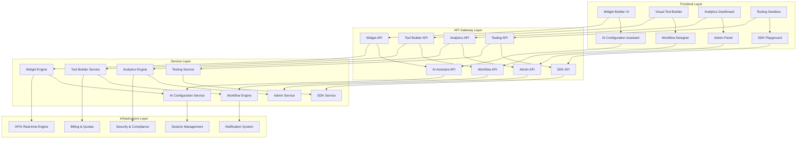

# Platform Completion System Design

## Overview

This design document outlines the architecture and implementation approach for completing the SynapseAI platform by addressing all missing, mocked, and partially implemented features. The design focuses on production-ready implementations that integrate seamlessly with existing infrastructure.

## Architecture

### High-Level Architecture



### Component Architecture

#### 1. Widget System Completion

**Widget Runtime Engine**
- Embedded widget execution environment
- Cross-origin security management
- Real-time communication with parent platform
- Performance monitoring and optimization

**Widget Marketplace**
- Template categorization and search
- Rating and review system
- One-click deployment mechanism
- Version management and updates

**Widget Analytics Engine**
- Real-time user interaction tracking
- Conversion funnel analysis
- Performance metrics collection
- Cross-domain analytics aggregation

#### 2. AI-Powered Configuration System

**Natural Language Processor**
- Intent recognition for configuration requests
- Context-aware suggestion generation
- Configuration validation and optimization
- Multi-language support

**Visual Builder Engine**
- Drag-and-drop component system
- Real-time preview generation
- Intelligent component suggestions
- Template-based rapid development

**API Pattern Detection**
- Automatic schema generation from API endpoints
- Authentication method detection
- Parameter mapping and validation
- Error handling pattern recognition

#### 3. Advanced Analytics and BI

**Real-time Analytics Engine**
- Stream processing for live metrics
- Cross-module data correlation
- Anomaly detection and alerting
- Predictive analytics modeling

**Business Intelligence Service**
- Custom dashboard creation
- Automated report generation
- Data export and API access
- Compliance reporting automation

**Cost Optimization Engine**
- Provider cost analysis
- Usage pattern optimization
- Budget forecasting and alerts
- ROI calculation and reporting

#### 4. Testing and Sandbox Environment

**Isolated Testing Environment**
- Containerized test execution
- Mock service integration
- Data isolation and cleanup
- Resource usage monitoring

**Debugging and Profiling Tools**
- Step-by-step execution tracing
- Variable inspection and modification
- Performance profiling and optimization
- Error reproduction and analysis

**Integration Testing Framework**
- Cross-module test orchestration
- End-to-end workflow validation
- Load testing and performance benchmarking
- Automated regression testing

#### 5. Admin Panel and System Management

**Organization Management System**
- Hierarchical organization structure
- Bulk user operations
- Role and permission management
- Resource allocation and quotas

**System Health Monitoring**
- Real-time module status tracking
- Performance metrics aggregation
- Predictive maintenance alerts
- Automated incident response

**Configuration Management**
- Global settings management
- Change tracking and rollback
- Environment-specific configurations
- Security policy enforcement

## Components and Interfaces

### Widget Runtime Interface

```typescript
interface WidgetRuntime {
  // Widget execution
  executeWidget(widgetId: string, input: any, context: ExecutionContext): Promise<ExecutionResult>;
  
  // Real-time communication
  establishConnection(widgetId: string, parentOrigin: string): Promise<Connection>;
  
  // Analytics tracking
  trackEvent(event: WidgetEvent): void;
  
  // Security validation
  validateOrigin(origin: string, allowedDomains: string[]): boolean;
}

interface ExecutionContext {
  sessionId: string;
  userId?: string;
  deviceInfo: DeviceInfo;
  geolocation?: GeolocationData;
  customData?: Record<string, any>;
}

interface WidgetEvent {
  type: 'view' | 'interaction' | 'conversion' | 'error';
  widgetId: string;
  sessionId: string;
  timestamp: Date;
  data: Record<string, any>;
}
```

### AI Configuration Interface

```typescript
interface AIConfigurationService {
  // Natural language processing
  processNaturalLanguage(description: string, context: ConfigurationContext): Promise<ConfigurationSuggestion>;
  
  // Visual builder assistance
  suggestComponents(currentConfig: any, userIntent: string): Promise<ComponentSuggestion[]>;
  
  // API pattern detection
  analyzeAPI(endpoint: string, method: string, headers?: Record<string, string>): Promise<APIAnalysis>;
  
  // Configuration optimization
  optimizeConfiguration(config: any, performanceMetrics: PerformanceMetrics): Promise<OptimizationSuggestions>;
}

interface ConfigurationSuggestion {
  confidence: number;
  suggestedConfig: any;
  explanation: string;
  alternatives: ConfigurationAlternative[];
}

interface APIAnalysis {
  schema: JSONSchema;
  authMethod: AuthenticationMethod;
  rateLimits: RateLimitInfo;
  errorPatterns: ErrorPattern[];
  suggestedParameters: ParameterSuggestion[];
}
```

### Analytics Engine Interface

```typescript
interface AnalyticsEngine {
  // Real-time metrics
  getRealtimeMetrics(filters: MetricFilters): Promise<RealtimeMetrics>;
  
  // Cross-module analytics
  getCrossModuleAnalytics(timeRange: TimeRange, modules: string[]): Promise<CrossModuleAnalytics>;
  
  // Predictive analytics
  generatePredictions(dataPoints: DataPoint[], predictionType: PredictionType): Promise<Prediction>;
  
  // Custom dashboards
  createDashboard(config: DashboardConfig): Promise<Dashboard>;
  
  // Automated insights
  generateInsights(data: AnalyticsData, context: InsightContext): Promise<Insight[]>;
}

interface CrossModuleAnalytics {
  userJourneys: UserJourney[];
  conversionFunnels: ConversionFunnel[];
  performanceMetrics: CrossModulePerformanceMetrics;
  costAnalysis: CrossModuleCostAnalysis;
}

interface UserJourney {
  sessionId: string;
  steps: JourneyStep[];
  totalDuration: number;
  conversionEvents: ConversionEvent[];
  dropoffPoints: DropoffPoint[];
}
```

### Testing Framework Interface

```typescript
interface TestingFramework {
  // Test environment management
  createTestEnvironment(config: TestEnvironmentConfig): Promise<TestEnvironment>;
  
  // Test execution
  executeTest(testSuite: TestSuite, environment: TestEnvironment): Promise<TestResult>;
  
  // Integration testing
  runIntegrationTests(modules: string[], testScenarios: TestScenario[]): Promise<IntegrationTestResult>;
  
  // Performance testing
  runPerformanceTests(loadConfig: LoadTestConfig): Promise<PerformanceTestResult>;
  
  // Debugging tools
  startDebuggingSession(executionId: string): Promise<DebuggingSession>;
}

interface TestEnvironment {
  id: string;
  isolationLevel: 'container' | 'process' | 'thread';
  mockServices: MockService[];
  dataFixtures: DataFixture[];
  resourceLimits: ResourceLimits;
}

interface DebuggingSession {
  sessionId: string;
  breakpoints: Breakpoint[];
  variableInspector: VariableInspector;
  executionTracer: ExecutionTracer;
  performanceProfiler: PerformanceProfiler;
}
```

## Data Models

### Widget Execution Model

```typescript
interface WidgetExecution {
  id: string;
  widgetId: string;
  sessionId: string;
  userId?: string;
  status: ExecutionStatus;
  input: ExecutionInput;
  output?: ExecutionOutput;
  context: ExecutionContext;
  metrics: ExecutionMetrics;
  createdAt: Date;
  completedAt?: Date;
  error?: ExecutionError;
}

interface ExecutionMetrics {
  startTime: Date;
  endTime?: Date;
  duration?: number;
  tokensUsed?: number;
  apiCalls: number;
  errorCount: number;
  cacheHits: number;
  cacheMisses: number;
  memoryUsage?: number;
  cpuUsage?: number;
}
```

### Analytics Data Model

```typescript
interface AnalyticsEvent {
  id: string;
  type: string;
  moduleId: string;
  userId: string;
  organizationId: string;
  sessionId: string;
  timestamp: Date;
  properties: Record<string, any>;
  context: EventContext;
  processed: boolean;
}

interface CrossModuleFlow {
  id: string;
  sessionId: string;
  userId: string;
  organizationId: string;
  startModule: string;
  endModule: string;
  steps: FlowStep[];
  totalDuration: number;
  success: boolean;
  createdAt: Date;
}

interface FlowStep {
  moduleId: string;
  action: string;
  timestamp: Date;
  duration: number;
  success: boolean;
  data: Record<string, any>;
  error?: string;
}
```

### Configuration Model

```typescript
interface AIConfiguration {
  id: string;
  type: 'agent' | 'tool' | 'workflow' | 'widget';
  naturalLanguageDescription: string;
  generatedConfig: any;
  confidence: number;
  userModifications: ConfigurationModification[];
  validationResults: ValidationResult[];
  optimizationSuggestions: OptimizationSuggestion[];
  createdAt: Date;
  updatedAt: Date;
}

interface ConfigurationModification {
  field: string;
  originalValue: any;
  newValue: any;
  reason: string;
  timestamp: Date;
  userId: string;
}
```

## Error Handling

### Comprehensive Error Management

```typescript
interface ErrorHandler {
  // Global error handling
  handleGlobalError(error: Error, context: ErrorContext): Promise<ErrorResponse>;
  
  // Module-specific error handling
  handleModuleError(moduleId: string, error: ModuleError): Promise<ModuleErrorResponse>;
  
  // Cross-module error propagation
  propagateError(error: CrossModuleError): Promise<void>;
  
  // Error recovery
  attemptRecovery(error: RecoverableError): Promise<RecoveryResult>;
}

interface ErrorContext {
  userId?: string;
  organizationId: string;
  sessionId: string;
  moduleId: string;
  operationId: string;
  timestamp: Date;
  stackTrace: string;
  additionalData: Record<string, any>;
}

interface RecoveryStrategy {
  type: 'retry' | 'fallback' | 'graceful_degradation' | 'user_intervention';
  maxAttempts: number;
  backoffStrategy: BackoffStrategy;
  fallbackAction?: () => Promise<any>;
  userNotification?: NotificationConfig;
}
```

## Testing Strategy

### Comprehensive Testing Approach

1. **Unit Testing**
   - Individual component testing
   - Mock service integration
   - Edge case validation
   - Performance benchmarking

2. **Integration Testing**
   - Cross-module communication
   - Data flow validation
   - Error propagation testing
   - Session management testing

3. **End-to-End Testing**
   - Complete user workflows
   - Widget embedding and execution
   - Analytics data collection
   - Billing and quota enforcement

4. **Performance Testing**
   - Load testing under realistic conditions
   - Stress testing for peak loads
   - Memory leak detection
   - Database performance optimization

5. **Security Testing**
   - Penetration testing
   - Vulnerability scanning
   - Access control validation
   - Data encryption verification

6. **Accessibility Testing**
   - WCAG 2.1 AA compliance
   - Screen reader compatibility
   - Keyboard navigation testing
   - Color contrast validation

## Security Considerations

### Multi-Layer Security Architecture

1. **Authentication and Authorization**
   - JWT token validation with refresh rotation
   - Role-based access control (RBAC)
   - Organization-scoped permissions
   - API key management for external access

2. **Data Protection**
   - End-to-end encryption for sensitive data
   - Database encryption at rest
   - Secure communication protocols (TLS 1.3)
   - PII data anonymization

3. **Widget Security**
   - Cross-origin resource sharing (CORS) validation
   - Content Security Policy (CSP) enforcement
   - Domain whitelist validation
   - Sandboxed execution environment

4. **API Security**
   - Rate limiting and throttling
   - Input validation and sanitization
   - SQL injection prevention
   - XSS protection

5. **Compliance**
   - GDPR compliance with data portability
   - SOC 2 Type II certification readiness
   - HIPAA compliance for healthcare data
   - Audit trail maintenance

## Performance Optimization

### Multi-Level Performance Strategy

1. **Frontend Optimization**
   - Code splitting and lazy loading
   - CDN integration for static assets
   - Browser caching strategies
   - Progressive web app features

2. **Backend Optimization**
   - Database query optimization
   - Redis caching for frequently accessed data
   - Connection pooling
   - Asynchronous processing

3. **Infrastructure Optimization**
   - Horizontal scaling with load balancing
   - Auto-scaling based on metrics
   - Container orchestration
   - Geographic distribution

4. **Real-time Optimization**
   - WebSocket connection pooling
   - Event batching and compression
   - Selective data synchronization
   - Connection health monitoring

This design provides a comprehensive foundation for completing the SynapseAI platform with production-ready implementations across all modules.