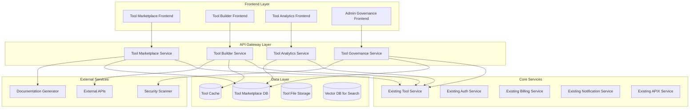

# Tool Marketplace & Advanced Tool Builder - Design Document

## Overview

The Tool Marketplace & Advanced Tool Builder system extends the existing SynapseAI tool infrastructure to provide a comprehensive ecosystem for tool creation, sharing, and discovery. The system leverages the existing APIX real-time engine, authentication, billing, and session management while adding sophisticated marketplace functionality, advanced visual building capabilities, and enterprise governance features.

## Architecture

### High-Level System Architecture



### Component Architecture

#### 1. Advanced Tool Builder Service

**Purpose:** Extends existing tool creation with visual building, AI assistance, and advanced configuration capabilities.

**Key Components:**
- **Visual Builder Engine:** Drag-and-drop interface with component library
- **AI Configuration Assistant:** Natural language to tool configuration conversion
- **API Discovery Service:** Automatic API schema detection and authentication setup
- **Real-time Testing Harness:** Secure sandbox for tool execution and validation
- **Schema Validation Engine:** Real-time validation of tool configurations and parameters

**Integration Points:**
- Extends existing Tool Service for CRUD operations
- Uses existing Session Service for builder state management
- Integrates with existing AI Provider Service for configuration assistance
- Uses existing APIX for real-time testing feedback

#### 2. Tool Marketplace Service

**Purpose:** Provides discovery, sharing, and installation of tools with community features.

**Key Components:**
- **Marketplace Catalog:** Tool discovery with search, filtering, and categorization
- **Publication Pipeline:** Tool validation, documentation generation, and approval workflow
- **Installation Engine:** Automated tool setup with guided configuration
- **Rating & Review System:** Community feedback and quality assessment
- **Monetization Framework:** Pricing, licensing, and revenue sharing

**Integration Points:**
- Uses existing Auth Service for user and organization management
- Integrates with existing Billing Service for marketplace transactions
- Uses existing Notification Service for marketplace events
- Leverages existing Analytics Service for marketplace metrics

#### 3. Tool Analytics Service

**Purpose:** Provides comprehensive performance monitoring, usage analytics, and optimization insights.

**Key Components:**
- **Performance Monitor:** Real-time tracking of tool execution metrics
- **Usage Analytics Engine:** Tool usage patterns and integration analysis
- **Cost Analysis System:** ROI calculations and cost optimization recommendations
- **Error Diagnostics:** Detailed error reporting and debugging assistance
- **Optimization Advisor:** AI-powered suggestions for tool improvements

**Integration Points:**
- Extends existing Analytics Service with tool-specific metrics
- Uses existing Session Service for execution context tracking
- Integrates with existing Billing Service for cost analysis
- Uses existing APIX for real-time performance streaming

#### 4. Tool Governance Service

**Purpose:** Provides enterprise-grade governance, security, and compliance management.

**Key Components:**
- **Policy Engine:** Configurable governance rules and enforcement
- **Security Scanner:** Automated vulnerability and compliance checking
- **Audit Trail System:** Comprehensive logging and compliance reporting
- **Access Control Manager:** Fine-grained permissions and approval workflows
- **Compliance Dashboard:** Real-time governance metrics and alerts

**Integration Points:**
- Uses existing Auth Service for role-based access control
- Integrates with existing Notification Service for governance alerts
- Uses existing Analytics Service for compliance reporting
- Leverages existing Session Service for audit trail context

## Data Models

### Enhanced Tool Schema

```typescript
interface EnhancedTool extends ExistingTool {
  // Marketplace fields
  marketplaceId?: string;
  publisherId: string;
  category: ToolCategory;
  tags: string[];
  rating: number;
  reviewCount: number;
  downloadCount: number;
  isPublic: boolean;
  pricing: ToolPricing;
  
  // Advanced configuration
  visualConfig: VisualToolConfig;
  aiGeneratedConfig: AIConfigMetadata;
  testingResults: ToolTestResults;
  
  // Analytics and performance
  performanceMetrics: ToolPerformanceMetrics;
  usageAnalytics: ToolUsageAnalytics;
  
  // Governance and security
  securityScan: SecurityScanResults;
  complianceStatus: ComplianceStatus;
  governancePolicy: GovernancePolicyRef;
}

interface VisualToolConfig {
  components: ToolComponent[];
  connections: ComponentConnection[];
  layout: LayoutConfiguration;
  theme: ThemeConfiguration;
}

interface ToolMarketplaceListing {
  id: string;
  toolId: string;
  publisherId: string;
  organizationId: string;
  title: string;
  description: string;
  longDescription: string;
  category: ToolCategory;
  subcategory: string;
  tags: string[];
  screenshots: string[];
  documentation: DocumentationMetadata;
  pricing: ToolPricing;
  licensing: LicenseConfiguration;
  compatibility: CompatibilityInfo;
  supportInfo: SupportConfiguration;
  publishedAt: Date;
  lastUpdated: Date;
  status: ListingStatus;
}

interface ToolReview {
  id: string;
  toolId: string;
  userId: string;
  organizationId: string;
  rating: number;
  title: string;
  content: string;
  pros: string[];
  cons: string[];
  usageContext: string;
  verified: boolean;
  helpful: number;
  createdAt: Date;
}
```

### Analytics and Performance Models

```typescript
interface ToolPerformanceMetrics {
  toolId: string;
  organizationId: string;
  timeframe: TimeframeType;
  executionCount: number;
  averageLatency: number;
  successRate: number;
  errorRate: number;
  resourceUsage: ResourceUsageMetrics;
  costMetrics: CostMetrics;
  qualityScore: number;
  lastUpdated: Date;
}

interface ToolUsageAnalytics {
  toolId: string;
  organizationId: string;
  totalExecutions: number;
  uniqueUsers: number;
  integrationPatterns: IntegrationPattern[];
  workflowUsage: WorkflowUsageMetrics;
  geographicUsage: GeographicUsageData;
  timeBasedUsage: TimeBasedUsageData;
  userFeedback: UserFeedbackSummary;
}

interface GovernancePolicy {
  id: string;
  organizationId: string;
  name: string;
  description: string;
  rules: PolicyRule[];
  enforcement: EnforcementLevel;
  scope: PolicyScope;
  exceptions: PolicyException[];
  auditRequirements: AuditRequirement[];
  createdBy: string;
  createdAt: Date;
  lastModified: Date;
}
```

## Component Interfaces

### Tool Builder Interface

```typescript
interface IToolBuilderService {
  // Visual building
  createVisualTool(config: VisualToolConfig): Promise<Tool>;
  updateVisualConfig(toolId: string, config: VisualToolConfig): Promise<void>;
  validateConfiguration(config: ToolConfiguration): Promise<ValidationResult>;
  
  // AI assistance
  generateConfigFromDescription(description: string): Promise<ToolConfiguration>;
  suggestOptimizations(toolId: string): Promise<OptimizationSuggestion[]>;
  detectAPISchema(apiUrl: string, auth: AuthConfig): Promise<APISchema>;
  
  // Testing and validation
  testToolInSandbox(toolId: string, testData: TestData): Promise<TestResult>;
  validateSecurity(toolConfig: ToolConfiguration): Promise<SecurityValidation>;
  generateDocumentation(toolId: string): Promise<Documentation>;
}

interface IToolMarketplaceService {
  // Discovery and search
  searchTools(query: SearchQuery): Promise<ToolSearchResult>;
  getToolsByCategory(category: ToolCategory): Promise<ToolListing[]>;
  getFeaturedTools(): Promise<ToolListing[]>;
  getRecommendations(userId: string): Promise<ToolRecommendation[]>;
  
  // Publishing and management
  publishTool(toolId: string, listingInfo: ListingInfo): Promise<MarketplaceListing>;
  updateListing(listingId: string, updates: ListingUpdate): Promise<void>;
  moderateListing(listingId: string, action: ModerationAction): Promise<void>;
  
  // Installation and management
  installTool(toolId: string, organizationId: string): Promise<InstallationResult>;
  configureTool(toolId: string, config: ToolConfig): Promise<void>;
  uninstallTool(toolId: string, organizationId: string): Promise<void>;
}
```

## Error Handling

### Tool Builder Error Handling

```typescript
enum ToolBuilderErrorType {
  CONFIGURATION_INVALID = 'CONFIGURATION_INVALID',
  API_CONNECTION_FAILED = 'API_CONNECTION_FAILED',
  SECURITY_VIOLATION = 'SECURITY_VIOLATION',
  SANDBOX_EXECUTION_FAILED = 'SANDBOX_EXECUTION_FAILED',
  AI_GENERATION_FAILED = 'AI_GENERATION_FAILED'
}

class ToolBuilderError extends Error {
  constructor(
    public type: ToolBuilderErrorType,
    public message: string,
    public details?: any,
    public suggestions?: string[]
  ) {
    super(message);
  }
}
```

### Marketplace Error Handling

```typescript
enum MarketplaceErrorType {
  TOOL_NOT_FOUND = 'TOOL_NOT_FOUND',
  INSTALLATION_FAILED = 'INSTALLATION_FAILED',
  PERMISSION_DENIED = 'PERMISSION_DENIED',
  PAYMENT_REQUIRED = 'PAYMENT_REQUIRED',
  COMPATIBILITY_ISSUE = 'COMPATIBILITY_ISSUE'
}

class MarketplaceError extends Error {
  constructor(
    public type: MarketplaceErrorType,
    public message: string,
    public toolId?: string,
    public organizationId?: string
  ) {
    super(message);
  }
}
```

## Testing Strategy

### Unit Testing
- **Tool Builder Components:** Test visual configuration generation, AI assistance, and validation logic
- **Marketplace Services:** Test search algorithms, installation processes, and rating systems
- **Analytics Engines:** Test metric calculation, aggregation, and reporting accuracy
- **Governance Policies:** Test rule evaluation, enforcement, and audit trail generation

### Integration Testing
- **End-to-End Tool Creation:** Test complete flow from visual building to marketplace publication
- **Cross-Service Communication:** Test integration with existing APIX, Auth, Billing, and Session services
- **Real API Integration:** Test actual external API connections and authentication flows
- **Performance Under Load:** Test system behavior with high tool usage and marketplace activity

### Security Testing
- **Tool Sandbox Security:** Test isolation and security of tool execution environment
- **API Credential Security:** Test secure storage and transmission of external API credentials
- **Marketplace Security:** Test protection against malicious tools and marketplace abuse
- **Governance Compliance:** Test enforcement of security policies and audit requirements

### User Acceptance Testing
- **Tool Builder Usability:** Test visual interface usability and AI assistance effectiveness
- **Marketplace Discovery:** Test search, filtering, and recommendation accuracy
- **Installation Experience:** Test guided setup and configuration processes
- **Performance Monitoring:** Test analytics dashboard usability and insight quality