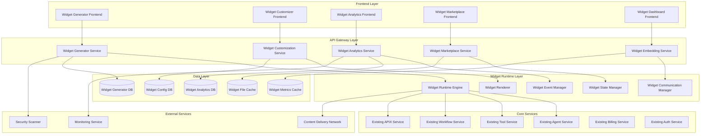

# Widget Generator & Embedding System - Design Document

## Overview

The Widget Generator & Embedding System transforms SynapseAI platform components (agents, tools, workflows) into embeddable widgets that can be integrated into external websites and applications. The system provides comprehensive widget creation, customization, deployment, and monitoring capabilities while maintaining security, performance, and brand consistency. It leverages the existing SynapseAI infrastructure while adding specialized widget generation, embedding, and analytics capabilities.

## Architecture

### High-Level System Architecture



### Component Architecture

#### 1. Widget Generator Service

**Purpose:** Creates widgets from existing platform components with configuration and optimization capabilities.

**Key Components:**
- **Component Analyzer:** Analyzes agents, tools, and workflows for widget compatibility
- **Widget Template Engine:** Generates widget templates based on component types
- **Configuration Generator:** Creates default configurations with optimization suggestions
- **Preview Engine:** Provides real-time widget preview with responsive testing
- **Validation Engine:** Validates widget configurations and dependencies
- **Export Manager:** Generates embed codes and deployment packages

**Integration Points:**
- Uses existing Agent, Tool, and Workflow services for component data
- Integrates with existing Auth Service for widget permissions
- Uses existing APIX for real-time preview updates
- Leverages existing Billing Service for widget usage tracking

#### 2. Widget Customization Service

**Purpose:** Provides comprehensive widget theming, branding, and behavior customization.

**Key Components:**
- **Theme Engine:** Advanced theming with CSS generation and optimization
- **Brand Manager:** Logo, color, and asset management with automatic optimization
- **Layout Engine:** Responsive layout generation with device-specific optimization
- **Behavior Configurator:** Widget interaction and flow customization
- **White-label Manager:** Complete branding removal and customization
- **Asset Optimizer:** Image, font, and resource optimization for performance

**Integration Points:**
- Uses existing File Storage for brand assets and themes
- Integrates with existing CDN for optimized asset delivery
- Uses existing Session Service for customization state management
- Leverages existing Analytics for customization effectiveness tracking

#### 3. Widget Runtime Engine

**Purpose:** Executes widgets in embedded environments with security, performance, and compatibility.

**Key Components:**
- **Execution Sandbox:** Secure widget execution environment with resource limits
- **Communication Bridge:** Secure communication between widget and parent application
- **State Manager:** Widget state persistence and synchronization
- **Event Handler:** Widget event processing and propagation
- **Security Manager:** XSS prevention, CSP enforcement, and vulnerability protection
- **Performance Monitor:** Real-time performance tracking and optimization

**Integration Points:**
- Connects to existing Agent, Tool, and Workflow execution engines
- Uses existing APIX for real-time communication and updates
- Integrates with existing Session Service for state management
- Uses existing Billing Service for usage metering and quota enforcement

#### 4. Widget Analytics Service

**Purpose:** Provides comprehensive analytics, monitoring, and optimization insights for widgets.

**Key Components:**
- **Usage Tracker:** Detailed widget interaction and engagement tracking
- **Performance Monitor:** Load times, response times, and error rate monitoring
- **User Journey Analyzer:** User behavior pattern analysis and optimization
- **Conversion Tracker:** Goal completion and conversion rate measurement
- **A/B Testing Engine:** Widget variant testing and optimization
- **Report Generator:** Customizable analytics reports and dashboards

**Integration Points:**
- Extends existing Analytics Service with widget-specific metrics
- Uses existing APIX for real-time analytics streaming
- Integrates with existing Notification Service for performance alerts
- Uses existing Billing Service for ROI and cost analysis

#### 5. Widget Marketplace Service

**Purpose:** Manages widget sharing, discovery, and monetization ecosystem.

**Key Components:**
- **Marketplace Catalog:** Widget discovery with search and categorization
- **Publishing Pipeline:** Widget validation, approval, and listing management
- **Transaction Manager:** Purchase processing, licensing, and revenue sharing
- **Rating System:** Community feedback and quality assessment
- **Installation Manager:** Guided widget setup and configuration
- **Update Manager:** Version management and seamless upgrades

**Integration Points:**
- Uses existing Tool Marketplace infrastructure for sharing capabilities
- Integrates with existing Billing Service for transactions and payments
- Uses existing Auth Service for marketplace permissions
- Leverages existing Notification Service for marketplace events

## Data Models

### Widget Configuration Schema

```typescript
interface WidgetConfiguration {
  id: string;
  name: string;
  description: string;
  organizationId: string;
  createdBy: string;
  
  // Source component
  sourceType: ComponentType; // 'agent' | 'tool' | 'workflow' | 'hybrid'
  sourceId: string;
  sourceConfig: ComponentConfiguration;
  
  // Widget settings
  widgetType: WidgetType;
  embedOptions: EmbedOptions;
  customization: WidgetCustomization;
  
  // Deployment
  deploymentStatus: DeploymentStatus;
  embedCode: EmbedCode[];
  domains: AllowedDomain[];
  
  // Analytics and monitoring
  analyticsConfig: AnalyticsConfiguration;
  performanceConfig: PerformanceConfiguration;
  
  // Security and governance
  securityConfig: SecurityConfiguration;
  governancePolicy: GovernancePolicyRef;
  
  // Metadata
  version: string;
  tags: string[];
  category: WidgetCategory;
  isPublic: boolean;
  marketplaceListing?: MarketplaceListingRef;
  
  createdAt: Date;
  updatedAt: Date;
  lastDeployed?: Date;
}

interface WidgetCustomization {
  theme: WidgetTheme;
  branding: BrandingConfiguration;
  layout: LayoutConfiguration;
  behavior: BehaviorConfiguration;
  localization: LocalizationConfiguration;
  accessibility: AccessibilityConfiguration;
}

interface WidgetTheme {
  id: string;
  name: string;
  colors: ColorPalette;
  typography: TypographyConfiguration;
  spacing: SpacingConfiguration;
  borders: BorderConfiguration;
  shadows: ShadowConfiguration;
  animations: AnimationConfiguration;
  customCSS?: string;
}

interface EmbedOptions {
  formats: EmbedFormat[];
  dimensions: DimensionConfiguration;
  responsive: ResponsiveConfiguration;
  loading: LoadingConfiguration;
  fallback: FallbackConfiguration;
  security: EmbedSecurityConfiguration;
}

interface EmbedFormat {
  type: EmbedType; // 'javascript' | 'iframe' | 'wordpress' | 'shopify' | 'api' | 'sdk'
  code: string;
  parameters: EmbedParameter[];
  documentation: string;
  examples: CodeExample[];
}
```

### Widget Analytics Schema

```typescript
interface WidgetAnalytics {
  widgetId: string;
  organizationId: string;
  timeframe: TimeframeType;
  
  // Usage metrics
  totalViews: number;
  uniqueUsers: number;
  totalInteractions: number;
  averageSessionDuration: number;
  bounceRate: number;
  
  // Performance metrics
  averageLoadTime: number;
  averageResponseTime: number;
  errorRate: number;
  uptime: number;
  
  // Engagement metrics
  interactionRate: number;
  completionRate: number;
  conversionRate: number;
  userSatisfaction: number;
  
  // Technical metrics
  browserStats: BrowserStatistics;
  deviceStats: DeviceStatistics;
  geographicStats: GeographicStatistics;
  
  // Business metrics
  revenue: number;
  costPerInteraction: number;
  roi: number;
  
  lastUpdated: Date;
}

interface WidgetUsageEvent {
  id: string;
  widgetId: string;
  sessionId: string;
  userId?: string;
  organizationId: string;
  
  eventType: WidgetEventType;
  eventData: WidgetEventData;
  
  timestamp: Date;
  userAgent: string;
  ipAddress: string;
  referrer: string;
  
  // Context
  pageUrl: string;
  widgetPosition: WidgetPosition;
  deviceInfo: DeviceInfo;
  browserInfo: BrowserInfo;
  
  // Performance
  loadTime?: number;
  responseTime?: number;
  errorDetails?: ErrorDetails;
}

interface WidgetMarketplaceListing {
  id: string;
  widgetId: string;
  publisherId: string;
  organizationId: string;
  
  title: string;
  description: string;
  longDescription: string;
  category: WidgetCategory;
  subcategory: string;
  tags: string[];
  
  screenshots: string[];
  demoUrl: string;
  documentation: DocumentationMetadata;
  
  pricing: WidgetPricing;
  licensing: LicenseConfiguration;
  
  compatibility: CompatibilityInfo;
  requirements: RequirementInfo;
  
  rating: number;
  reviewCount: number;
  downloadCount: number;
  
  publishedAt: Date;
  lastUpdated: Date;
  status: ListingStatus;
}
```

### Widget Runtime Schema

```typescript
interface WidgetRuntime {
  widgetId: string;
  sessionId: string;
  instanceId: string;
  
  // Configuration
  config: WidgetConfiguration;
  customization: WidgetCustomization;
  embedContext: EmbedContext;
  
  // State
  currentState: WidgetState;
  stateHistory: WidgetStateSnapshot[];
  
  // Communication
  messageQueue: WidgetMessage[];
  eventListeners: EventListener[];
  
  // Performance
  performanceMetrics: RuntimePerformanceMetrics;
  resourceUsage: ResourceUsageMetrics;
  
  // Security
  securityContext: SecurityContext;
  permissions: WidgetPermissions;
  
  createdAt: Date;
  lastActivity: Date;
}

interface WidgetState {
  phase: WidgetPhase; // 'loading' | 'ready' | 'executing' | 'error' | 'complete'
  data: WidgetStateData;
  ui: WidgetUIState;
  errors: WidgetError[];
  warnings: WidgetWarning[];
}

interface WidgetMessage {
  id: string;
  type: MessageType;
  source: MessageSource;
  target: MessageTarget;
  payload: MessagePayload;
  timestamp: Date;
  processed: boolean;
}
```

## Component Interfaces

### Widget Generator Interface

```typescript
interface IWidgetGeneratorService {
  // Widget creation
  generateWidget(sourceId: string, sourceType: ComponentType): Promise<WidgetConfiguration>;
  customizeWidget(widgetId: string, customization: WidgetCustomization): Promise<void>;
  previewWidget(widgetId: string, previewConfig: PreviewConfiguration): Promise<PreviewResult>;
  validateWidget(widgetId: string): Promise<ValidationResult>;
  
  // Embed code generation
  generateEmbedCode(widgetId: string, format: EmbedType): Promise<EmbedCode>;
  generateMultipleFormats(widgetId: string): Promise<EmbedFormat[]>;
  optimizeEmbedCode(embedCode: EmbedCode): Promise<OptimizedEmbedCode>;
  
  // Deployment
  deployWidget(widgetId: string, deploymentConfig: DeploymentConfiguration): Promise<DeploymentResult>;
  updateDeployment(widgetId: string, updates: DeploymentUpdate): Promise<void>;
  rollbackDeployment(widgetId: string, version: string): Promise<void>;
}

interface IWidgetRuntimeService {
  // Runtime management
  initializeWidget(widgetId: string, embedContext: EmbedContext): Promise<WidgetRuntime>;
  executeWidget(runtimeId: string, input: WidgetInput): Promise<WidgetOutput>;
  updateWidgetState(runtimeId: string, stateUpdate: WidgetStateUpdate): Promise<void>;
  destroyWidget(runtimeId: string): Promise<void>;
  
  // Communication
  sendMessage(runtimeId: string, message: WidgetMessage): Promise<void>;
  receiveMessage(runtimeId: string): Promise<WidgetMessage[]>;
  subscribeToEvents(runtimeId: string, eventTypes: WidgetEventType[]): Promise<EventSubscription>;
  
  // Security
  validatePermissions(runtimeId: string, action: WidgetAction): Promise<boolean>;
  enforceSecurityPolicy(runtimeId: string, policy: SecurityPolicy): Promise<void>;
  scanForVulnerabilities(widgetId: string): Promise<SecurityScanResult>;
}

interface IWidgetAnalyticsService {
  // Event tracking
  trackEvent(event: WidgetUsageEvent): Promise<void>;
  trackPerformance(metrics: WidgetPerformanceMetrics): Promise<void>;
  trackError(error: WidgetError): Promise<void>;
  
  // Analytics queries
  getUsageAnalytics(widgetId: string, timeframe: TimeframeType): Promise<WidgetAnalytics>;
  getPerformanceMetrics(widgetId: string, timeframe: TimeframeType): Promise<PerformanceMetrics>;
  getUserJourneyAnalysis(widgetId: string): Promise<UserJourneyAnalysis>;
  
  // Optimization
  identifyOptimizationOpportunities(widgetId: string): Promise<OptimizationOpportunity[]>;
  generatePerformanceReport(widgetId: string): Promise<PerformanceReport>;
  compareWidgetPerformance(widgetIds: string[]): Promise<PerformanceComparison>;
}
```

## Error Handling

### Widget Generation Error Handling

```typescript
enum WidgetGeneratorErrorType {
  INVALID_SOURCE_COMPONENT = 'INVALID_SOURCE_COMPONENT',
  CUSTOMIZATION_FAILED = 'CUSTOMIZATION_FAILED',
  EMBED_CODE_GENERATION_FAILED = 'EMBED_CODE_GENERATION_FAILED',
  DEPLOYMENT_FAILED = 'DEPLOYMENT_FAILED',
  VALIDATION_FAILED = 'VALIDATION_FAILED',
  SECURITY_VIOLATION = 'SECURITY_VIOLATION'
}

class WidgetGeneratorError extends Error {
  constructor(
    public type: WidgetGeneratorErrorType,
    public message: string,
    public widgetId?: string,
    public sourceId?: string,
    public details?: any
  ) {
    super(message);
  }
}
```

### Widget Runtime Error Handling

```typescript
enum WidgetRuntimeErrorType {
  INITIALIZATION_FAILED = 'INITIALIZATION_FAILED',
  EXECUTION_FAILED = 'EXECUTION_FAILED',
  COMMUNICATION_ERROR = 'COMMUNICATION_ERROR',
  SECURITY_VIOLATION = 'SECURITY_VIOLATION',
  RESOURCE_EXHAUSTED = 'RESOURCE_EXHAUSTED',
  PERMISSION_DENIED = 'PERMISSION_DENIED'
}

class WidgetRuntimeError extends Error {
  constructor(
    public type: WidgetRuntimeErrorType,
    public message: string,
    public runtimeId?: string,
    public widgetId?: string,
    public recovery?: RecoveryStrategy
  ) {
    super(message);
  }
}
```

## Security Architecture

### Widget Security Framework

```typescript
interface WidgetSecurityConfiguration {
  // Content Security Policy
  csp: CSPConfiguration;
  
  // Cross-origin settings
  cors: CORSConfiguration;
  allowedOrigins: string[];
  
  // Authentication and authorization
  authRequired: boolean;
  permissions: WidgetPermission[];
  
  // Data protection
  dataEncryption: EncryptionConfiguration;
  dataRetention: RetentionPolicy;
  
  // Vulnerability protection
  xssProtection: XSSProtectionConfiguration;
  inputSanitization: SanitizationConfiguration;
  
  // Monitoring and alerting
  securityMonitoring: SecurityMonitoringConfiguration;
  incidentResponse: IncidentResponseConfiguration;
}

interface SecurityScanResult {
  widgetId: string;
  scanDate: Date;
  vulnerabilities: SecurityVulnerability[];
  recommendations: SecurityRecommendation[];
  riskScore: number;
  complianceStatus: ComplianceStatus;
}
```

## Testing Strategy

### Unit Testing
- **Widget Generator Components:** Test widget creation, customization, and embed code generation
- **Widget Runtime Engine:** Test widget execution, state management, and communication
- **Analytics Services:** Test event tracking, metrics calculation, and report generation
- **Security Components:** Test vulnerability scanning, permission enforcement, and data protection

### Integration Testing
- **End-to-End Widget Lifecycle:** Test complete flow from creation to deployment and monitoring
- **Cross-Platform Embedding:** Test widget functionality across different platforms and browsers
- **Real-time Communication:** Test APIX integration and real-time updates
- **Security Integration:** Test security policies and vulnerability protection

### Performance Testing
- **Widget Load Performance:** Test widget loading times and resource usage
- **Concurrent Widget Execution:** Test system behavior with multiple simultaneous widgets
- **Analytics Performance:** Test analytics collection and processing under load
- **CDN and Caching:** Test content delivery and caching effectiveness

### Security Testing
- **XSS and Injection Protection:** Test protection against common web vulnerabilities
- **Cross-Origin Security:** Test CORS policies and origin validation
- **Data Protection:** Test encryption and data handling compliance
- **Permission Enforcement:** Test access control and authorization mechanisms

### User Experience Testing
- **Widget Usability:** Test widget interfaces across different devices and browsers
- **Customization Experience:** Test theming and branding customization tools
- **Analytics Dashboard:** Test analytics visualization and report generation
- **Marketplace Experience:** Test widget discovery and installation processes