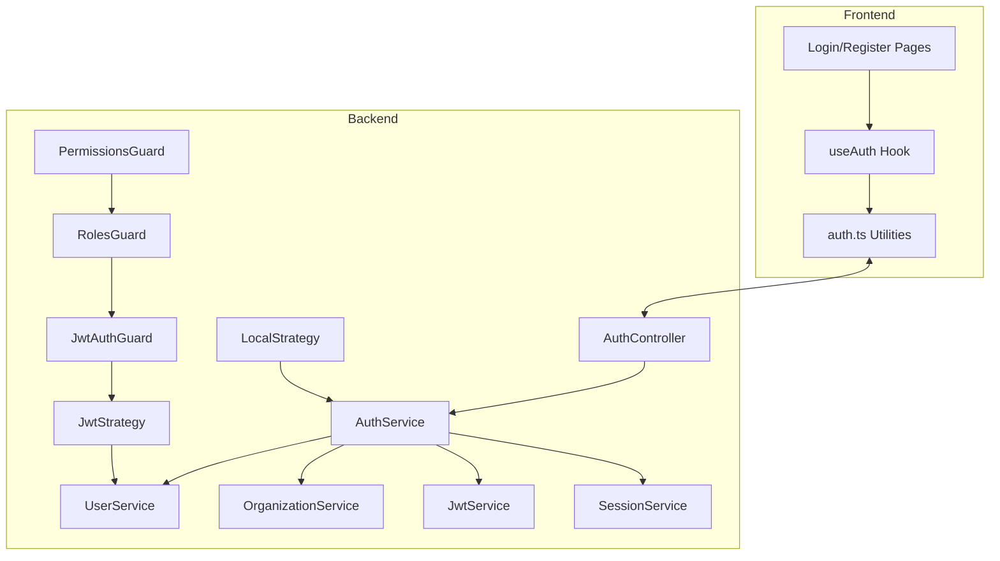

# Authentication System Review

## Executive Summary

The authentication system in the Synapse Plan project is a robust, multi-tenant system with role-based access control (RBAC) and comprehensive security features. The system is designed with a clear separation between backend and frontend components, follows industry best practices, and provides a solid foundation for a production-ready application. However, there are some areas that require attention before the system can be considered fully production-ready.

## Architecture Overview

## Backend Implementation

### Core Components

1. **AuthService**:
   - Handles user authentication, token generation, and session management
   - Implements security features like account lockout and token blacklisting
   - Provides JWT token generation and validation

2. **UserService**:
   - Manages user CRUD operations
   - Handles user-specific operations like email verification and password reset
   - Implements role validation logic

3. **OrganizationService**:
   - Manages organization CRUD operations
   - Implements multi-tenancy features
   - Handles organization-specific settings and quotas

4. **Authentication Guards**:
   - JwtAuthGuard: Validates JWT tokens and handles public routes
   - RolesGuard: Implements role-based access control
   - PermissionsGuard: Provides fine-grained permission control

5. **Authentication Strategies**:
   - LocalStrategy: Handles username/password authentication
   - JwtStrategy: Validates JWT tokens and populates user information

### Security Features

1. **JWT Authentication**:
   - Secure token generation with configurable expiration
   - Refresh token mechanism
   - Token blacklisting for logout and security

2. **Account Protection**:
   - Brute force protection with account lockout
   - Configurable failed login attempt limits
   - Password hashing with bcrypt (12 rounds)

3. **Multi-tenancy Security**:
   - Organization-level isolation
   - Cross-tenant access prevention
   - Organization status validation

4. **API Security**:
   - Rate limiting for sensitive endpoints
   - CSRF protection
   - Proper error handling to prevent information leakage

## Frontend Implementation

1. **Authentication Utilities**:
   - Token management (storage, retrieval, clearing)
   - Login, register, and logout functionality
   - User state management

2. **React Hooks**:
   - useAuth: Provides authentication state and methods to React components
   - Handles token refresh and user profile updates

3. **Authentication UI**:
   - Login page with validation
   - Registration page with validation
   - Password visibility toggle
   - Error handling and user feedback

## RBAC Implementation

The system implements a comprehensive role-based access control system with four roles:

1. **SUPER_ADMIN**: System-wide administrative access
2. **ORG_ADMIN**: Organization-level administrative access
3. **DEVELOPER**: Standard user with creation and execution permissions
4. **VIEWER**: Read-only access to resources

The permissions system provides fine-grained control over:

- Agent management (create, read, update, delete, execute)
- Tool management
- Workflow management
- Knowledge management
- User management
- Organization management
- Analytics access
- System administration

## Multi-tenancy Implementation

The system supports multi-tenancy through:

1. **Organization Isolation**:
   - Each user belongs to an organization
   - Resources are scoped to organizations
   - Cross-organization access is prevented

2. **Tenant-specific Settings**:
   - Organization-level configuration
   - Custom quotas and limits
   - Subscription plans with different capabilities

3. **Tenant Management**:
   - Organization creation and management
   - User management within organizations
   - Organization-level analytics and reporting

## Code Quality Assessment

### Strengths

1. **Well-structured Architecture**:
   - Clear separation of concerns
   - Modular design with focused services
   - Consistent error handling

2. **Security Best Practices**:
   - Proper password hashing
   - Token management
   - Rate limiting
   - Input validation

3. **Comprehensive RBAC**:
   - Role hierarchy
   - Fine-grained permissions
   - Decorator-based access control

4. **Clean Frontend Integration**:
   - React hooks for state management
   - Proper token handling
   - Consistent error handling

### Areas for Improvement

1. **Token Refresh Mechanism**:
   - The frontend token refresh could be more robust
   - Silent refresh implementation could be improved

2. **Error Handling**:
   - Some error messages could be more specific
   - More consistent error handling across services

3. **Testing Coverage**:
   - No evidence of comprehensive test coverage
   - Authentication flows should be thoroughly tested

4. **Documentation**:
   - Limited inline documentation
   - Missing API documentation for authentication endpoints

## Production Readiness

### Ready for Production

1. **Security Implementation**:
   - JWT implementation follows best practices
   - Password handling is secure
   - Rate limiting is in place

2. **RBAC System**:
   - Role-based access control is comprehensive
   - Permission system is flexible and extensible

3. **Multi-tenancy**:
   - Organization isolation is well-implemented
   - Tenant-specific settings are supported

### Needs Attention Before Production

1. **Session Management**:
   - Session timeout handling could be improved
   - Session revocation across devices needs implementation

2. **Audit Logging**:
   - Authentication events should be logged more comprehensively
   - Security events should be properly tracked

3. **Two-Factor Authentication**:
   - No implementation of 2FA
   - Should be added for production security

4. **Password Policies**:
   - Password complexity requirements need enforcement
   - Password expiration policies are missing

5. **Testing**:
   - Comprehensive testing of authentication flows is needed
   - Security testing should be performed

## Recommendations

### High Priority

1. **Implement Two-Factor Authentication**:
   - Add TOTP-based 2FA
   - Support backup codes
   - Make 2FA optional but encouraged

2. **Enhance Password Policies**:
   - Enforce password complexity requirements
   - Implement password expiration
   - Add password history to prevent reuse

3. **Improve Audit Logging**:
   - Log all authentication events
   - Track security-related actions
   - Implement alerting for suspicious activities

### Medium Priority

1. **Enhance Token Refresh**:
   - Implement silent refresh
   - Add token rotation on refresh
   - Improve client-side token management

2. **Add Comprehensive Testing**:
   - Unit tests for authentication services
   - Integration tests for authentication flows
   - Security testing for authentication endpoints

3. **Improve Error Handling**:
   - Standardize error responses
   - Add more detailed error logging
   - Implement better client-side error handling

### Low Priority

1. **Enhance Documentation**:
   - Add inline documentation
   - Create API documentation for authentication endpoints
   - Document authentication flows

2. **Implement Social Authentication**:
   - Complete the Google and Facebook authentication
   - Add other popular providers (GitHub, Microsoft)

3. **User Self-service**:
   - Add account management features
   - Implement self-service password reset
   - Add profile management

## Conclusion

The authentication system in the Synapse Plan project provides a solid foundation with good security practices, comprehensive RBAC, and multi-tenancy support. With some enhancements to session management, audit logging, and the addition of two-factor authentication, the system would be ready for production use. The code quality is generally good, with clear separation of concerns and consistent error handling, though additional testing and documentation would improve maintainability and reliability.
