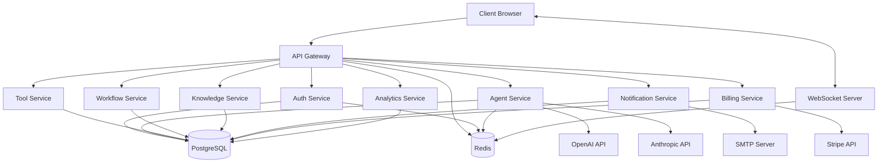

# Synapse Plan - Project Review Report

## 1. Project Overview

### Purpose and Scope
Synapse Plan is a platform for building, configuring, and managing AI agents with visual tools. The platform allows users to create, customize, and deploy AI agents with different personalities, capabilities, and integrations. The system supports a multi-tenant architecture with organizations and users.

### Technology Stack
- **Frontend**: Next.js 14, React 18, TypeScript, Tailwind CSS, Shadcn UI
- **Backend**: NestJS 11, TypeORM, PostgreSQL, Redis
- **Authentication**: JWT-based authentication with refresh tokens
- **AI Integration**: OpenAI API
- **Real-time Communication**: Socket.IO
- **Containerization**: Docker, Docker Compose
- **State Management**: React Hooks, Context API
- **Form Handling**: React Hook Form, Zod validation
- **UI Components**: Radix UI primitives with Tailwind styling
- **Visualization**: ReactFlow for visual agent building

### Architecture Overview
The application follows a microservices architecture with the following components:

1. **Frontend**: Next.js application with React components for the user interface
2. **API Gateway**: NestJS application serving as the entry point for all client requests
3. **Microservices**:
   - Auth Service: Handles authentication and user management
   - Agent Service: Manages AI agent configuration and execution
   - Tool Service: Provides tools and integrations for agents
   - Workflow Service: Manages workflows and automation
   - Knowledge Service: Handles knowledge bases and data sources
   - Notification Service: Manages notifications and alerts
   - Billing Service: Handles subscription and payment processing
   - Analytics Service: Provides usage statistics and insights

#### Data Flow Diagram

### Key Dependencies and External Integrations
- **OpenAI API**: Used for AI agent capabilities and natural language processing
- **Anthropic API**: Alternative AI model provider
- **Stripe**: Payment processing integration
- **SMTP**: Email notifications
- **Redis**: Caching, session management, and real-time communication
- **PostgreSQL**: Primary database for persistent storage
- **DataDog**: Monitoring and observability (configured but not fully implemented)

## 2. Module Analysis

### Production-Ready Modules
1. **Authentication System**:
   - JWT-based authentication with refresh tokens
   - Password hashing with bcrypt
   - CSRF protection
   - Account lockout after failed attempts
   - Token blacklisting

2. **UI Component Library**:
   - Complete set of reusable UI components based on Shadcn UI
   - Theming support with light/dark mode
   - Responsive design

3. **Database Schema**:
   - Well-defined entity relationships
   - Base entity with common fields
   - Multi-tenant support with organization context

### Mock/Simulated Components
1. **AI Assistant**:
   - The AI configuration assistant uses mock data for semantic analysis
   - Smart defaults are hardcoded rather than dynamically generated
   - Configuration validation is implemented but uses predefined rules

2. **Dashboard Overview**:
   - Uses mock data for statistics and activity feed
   - Charts and graphs display simulated data

3. **WebSocket Service**:
   - Basic implementation for real-time updates
   - Event handling structure is in place but not fully integrated with backend

4. **API Client**:
   - Implementation for authentication endpoints
   - Generic methods for CRUD operations
   - Token refresh mechanism
   - Error handling for authentication failures

### Incomplete/Partial Implementations
1. **Agent Execution**:
   - Visual builder UI is implemented
   - Backend execution engine is not fully implemented
   - Integration with AI models is incomplete

2. **Tool Integration**:
   - Tool definitions exist in the database schema
   - UI for tool configuration is partially implemented
   - Actual tool execution is not implemented

3. **Workflow System**:
   - Database schema is defined
   - UI components for workflow design are partially implemented
   - Workflow execution engine is not implemented

4. **Billing and Subscription**:
   - Stripe integration is configured in docker-compose
   - No implementation for subscription plans, usage tracking, or billing

5. **Knowledge Management**:
   - Database schema is defined
   - No implementation for knowledge ingestion, retrieval, or integration with agents

## 3. Code Quality Assessment

### Overall Code Structure and Organization
- **Frontend**: Well-organized with clear separation of concerns:
  - Components are modular and reusable
  - Hooks for shared logic
  - Lib directory for services and utilities
  - Types directory for TypeScript definitions
  - App directory follows Next.js app router convention

- **Backend**: Follows NestJS best practices:
  - Modular architecture with clear separation of controllers, services, and DTOs
  - Shared libraries for common functionality
  - Microservices structure is well-defined
  - Entities are properly organized with relationships

### Testing Coverage and Quality
- **Testing Framework**: Jest is configured but minimal tests are implemented
- **Frontend Testing**: No evidence of component tests or end-to-end tests
- **Backend Testing**: No evidence of unit tests or integration tests
- **Test Coverage**: Insufficient for production deployment

### Documentation Completeness
- **Code Comments**: Minimal inline documentation
- **API Documentation**: No Swagger/OpenAPI documentation
- **README**: Empty or minimal information
- **Architecture Documentation**: Missing comprehensive documentation

### Error Handling and Logging
- **Frontend**: Basic error handling in API client and auth service
- **Backend**: Exception filters and error handling in auth service
- **Logging**: Winston logger configured but not consistently used
- **Monitoring**: DataDog integration configured but not fully implemented

### Security Considerations
- **Authentication**: Strong implementation with JWT, refresh tokens, and CSRF protection
- **Authorization**: Role-based guards implemented but not consistently applied
- **Data Validation**: Input validation with class-validator on the backend
- **CORS**: Configured but not restrictive enough for production
- **Rate Limiting**: Configured with @nestjs/throttler but not consistently applied
- **Secrets Management**: Environment variables used but no vault integration
- **XSS Protection**: Limited protection through input validation

## 4. Production Readiness Analysis

### Critical Gaps
1. **Testing**: Lack of comprehensive test coverage across frontend and backend
2. **Error Handling**: Inconsistent error handling and recovery mechanisms
3. **Documentation**: Missing API documentation and developer guides
4. **Monitoring**: Incomplete observability and alerting setup
5. **CI/CD**: No continuous integration or deployment pipeline

### Configuration Management
- **Environment Variables**: Used for configuration but not well-documented
- **Secrets**: Hardcoded in docker-compose for development, no secure solution for production
- **Feature Flags**: Not implemented

### Database Setup and Migrations
- **Schema**: Well-defined entity relationships
- **Migrations**: No migration scripts found
- **Seeding**: Initial database script available but minimal
- **Backup/Restore**: Not configured

### Deployment Readiness
- **Docker**: Containerization is well-configured for development
- **Kubernetes**: No Kubernetes manifests or Helm charts
- **Scaling**: No configuration for horizontal scaling
- **Load Balancing**: Not configured
- **SSL/TLS**: Not configured

### Monitoring and Observability
- **Logging**: Winston configured but not consistently used
- **Metrics**: DataDog integration configured but not fully implemented
- **Tracing**: Not implemented
- **Alerting**: Not configured
- **Health Checks**: Basic health check endpoint implemented

## 5. Recommendations

### Priority Improvements for Production Launch
1. **Implement Comprehensive Testing**:
   - Add unit tests for critical backend services
   - Add component tests for frontend components
   - Implement integration tests for API endpoints
   - Add end-to-end tests for critical user flows

2. **Complete Core Functionality**:
   - Finish agent execution engine
   - Implement tool integration
   - Complete workflow execution engine
   - Implement knowledge management

3. **Enhance Security**:
   - Implement proper secrets management
   - Configure strict CORS policies
   - Apply consistent authorization checks
   - Add input validation for all endpoints

4. **Set Up CI/CD Pipeline**:
   - Implement automated testing
   - Configure build and deployment workflows
   - Set up environment-specific configurations

5. **Implement Monitoring and Observability**:
   - Complete DataDog integration
   - Set up alerting for critical services
   - Implement structured logging across all services
   - Add health check endpoints for all services

### Technical Debt to Address
1. **Mock Implementations**:
   - Replace mock data with real implementations
   - Implement real semantic analysis for AI assistant
   - Connect dashboard to real data sources

2. **Code Documentation**:
   - Add inline documentation for complex functions
   - Generate API documentation with Swagger/OpenAPI
   - Create developer guides and onboarding documentation

3. **Database Migrations**:
   - Implement proper migration strategy
   - Create scripts for database seeding
   - Configure backup and restore procedures

4. **Error Handling**:
   - Implement consistent error handling across all services
   - Add retry mechanisms for transient failures
   - Improve error messages and logging

### Performance Optimization Opportunities
1. **Frontend Optimizations**:
   - Implement code splitting and lazy loading
   - Optimize bundle size
   - Add caching for API responses
   - Implement server-side rendering for critical pages

2. **Backend Optimizations**:
   - Optimize database queries
   - Implement caching for frequently accessed data
   - Configure connection pooling
   - Optimize API response payloads

3. **Infrastructure Optimizations**:
   - Configure auto-scaling for services
   - Implement CDN for static assets
   - Optimize Docker images for production
   - Configure proper resource limits

### Security Enhancements Required
1. **Authentication and Authorization**:
   - Implement MFA (Multi-Factor Authentication)
   - Add IP-based restrictions for sensitive operations
   - Implement audit logging for security events

2. **Data Protection**:
   - Encrypt sensitive data at rest
   - Implement proper data retention policies
   - Add data masking for sensitive information

3. **API Security**:
   - Implement API keys for external integrations
   - Add request signing for sensitive operations
   - Configure proper rate limiting

4. **Infrastructure Security**:
   - Configure network security groups
   - Implement WAF (Web Application Firewall)
   - Set up vulnerability scanning

### Scalability Considerations
1. **Horizontal Scaling**:
   - Configure services for stateless operation
   - Implement proper load balancing
   - Configure auto-scaling based on metrics

2. **Database Scaling**:
   - Implement read replicas for read-heavy operations
   - Configure connection pooling
   - Consider sharding for multi-tenant data

3. **Caching Strategy**:
   - Implement distributed caching
   - Configure cache invalidation
   - Optimize cache hit rates

4. **Asynchronous Processing**:
   - Implement message queues for background tasks
   - Configure worker pools for CPU-intensive operations
   - Implement retry mechanisms for failed tasks

## Conclusion

The Synapse Plan project demonstrates a solid foundation with a well-structured architecture and good use of modern technologies. The frontend components are well-designed and the backend follows good practices for a microservices architecture.

However, the project is not yet production-ready due to several critical gaps, particularly in testing, documentation, and the completion of core functionality. Many components are still using mock data or have incomplete implementations.

By addressing the recommendations outlined in this report, particularly the priority improvements for production launch, the project can be brought to a production-ready state. The technical debt should be addressed in parallel to ensure long-term maintainability and scalability.

The security implementation is relatively strong, particularly the authentication system, but additional security enhancements are recommended before deploying to production.

Overall, the project shows promise but requires significant work to complete the implementation of core features and address the gaps identified in this review. 